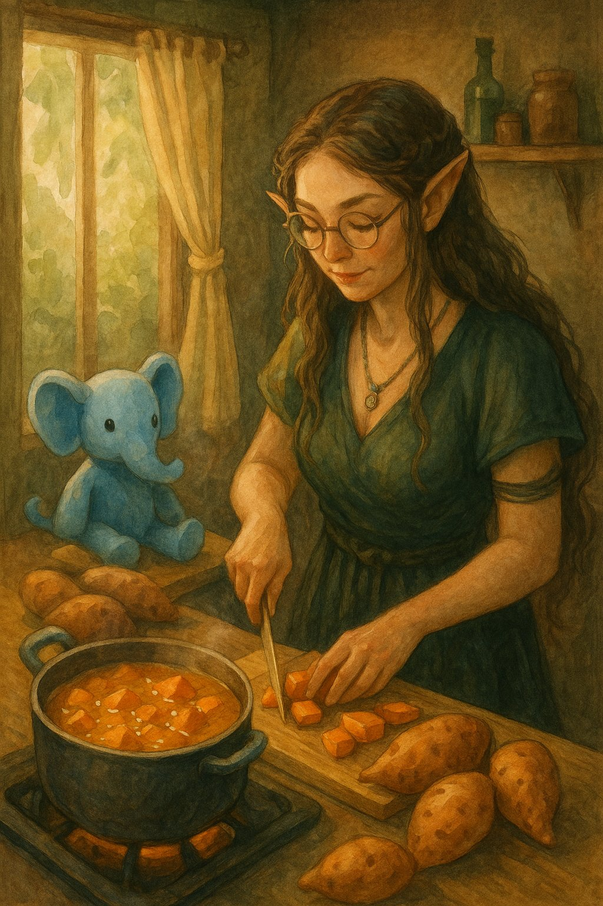
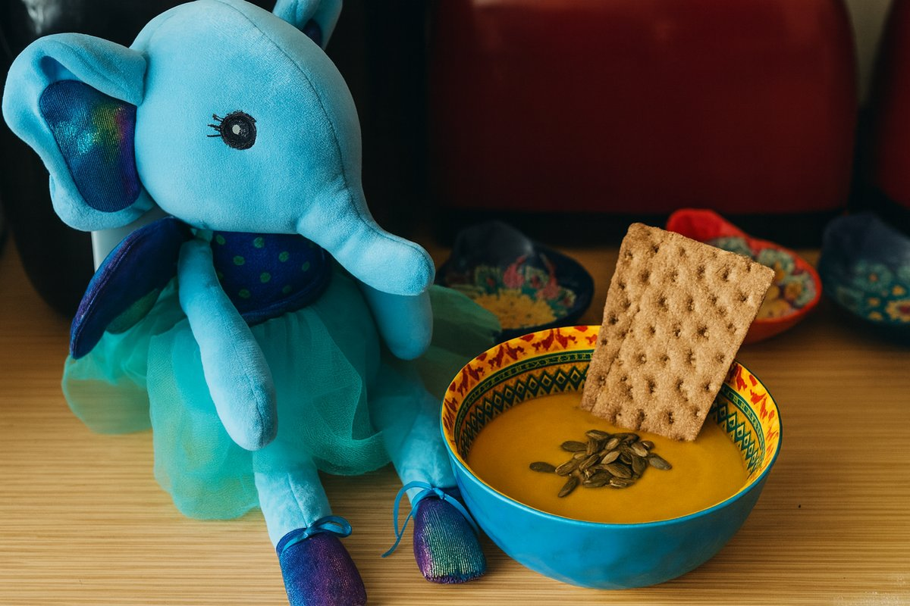
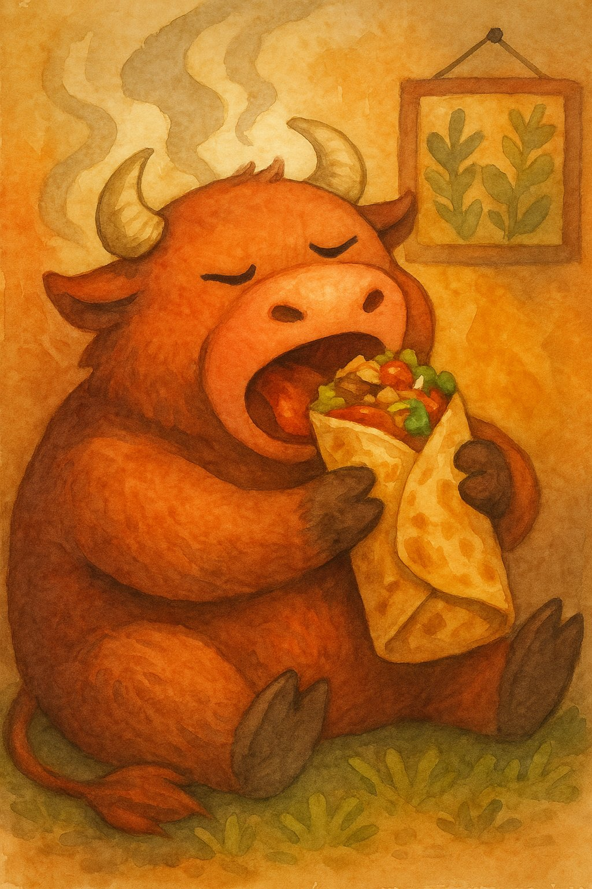
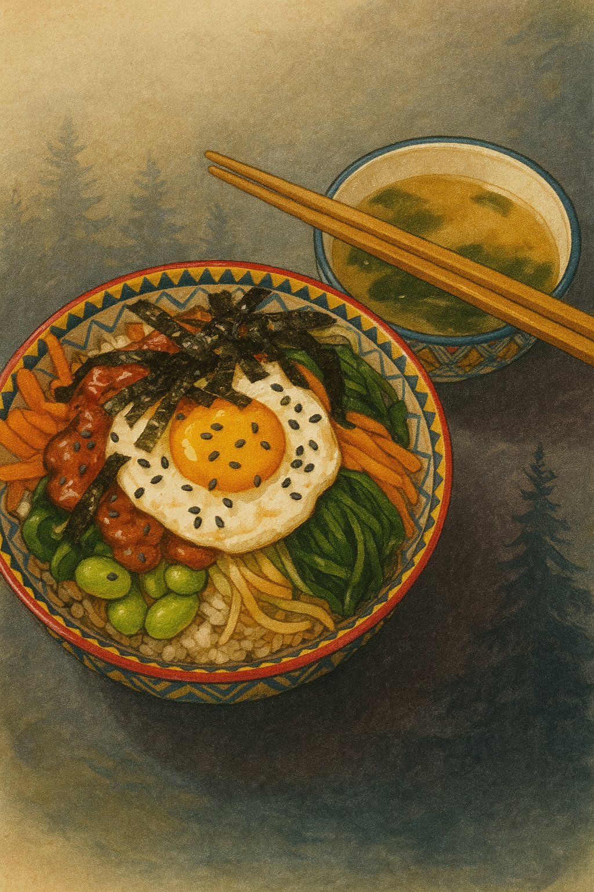
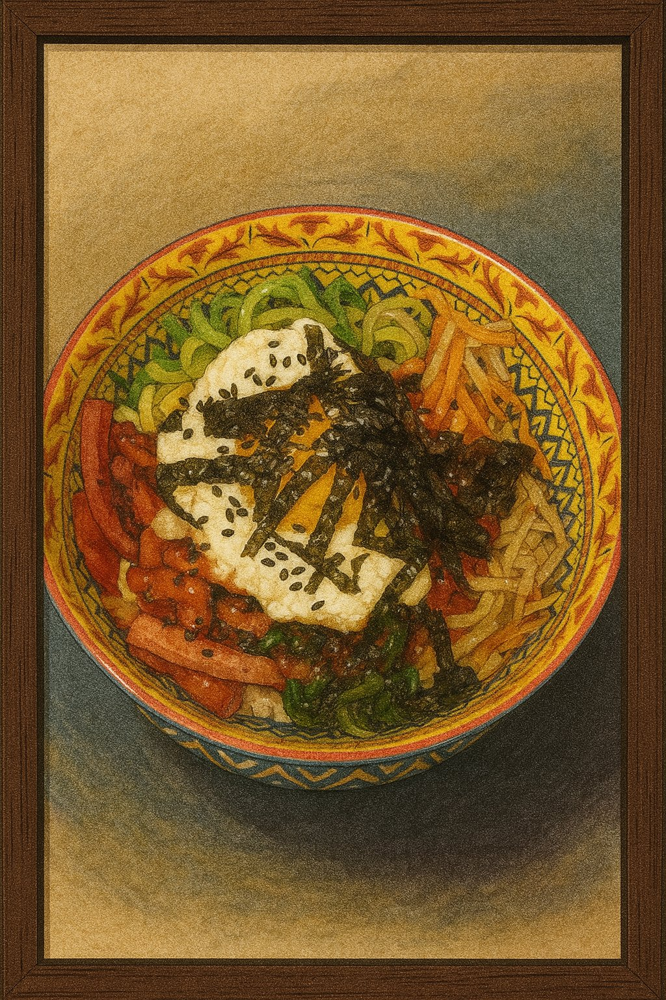
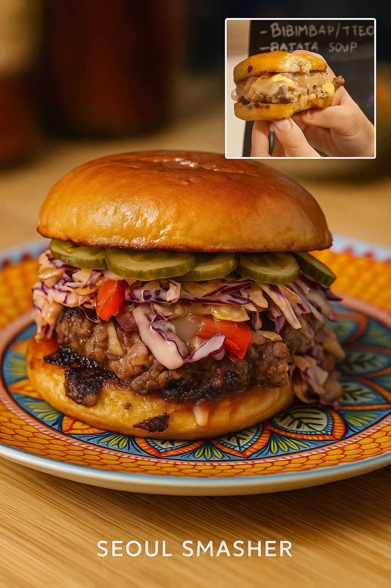

# Kumpli Recipes

## Batata And Coconut Soup {#batata-and-coconut-soup}

# Kumpli Recipe: Batata & Coconut Soup  
## (Sri Lankan Inspired)

## Background
This is Maa’s soup.

She discovered it during a gentle summer in Medvelak — the bear-quiet cottage nestled in the woods, where trees listened and time slowed down. It became a ritual of sweetness and stillness. The first time she made it, the batata melted like sunlight in her hands, and the coconut milk steamed like breath on a cool morning.

Maa doesn’t always like soup. But this one? It’s different. It tastes like dessert and memory at once — soft, sweet, lightly spiced. Like something kind from a dream that stayed behind in the pot. She often cooked it barefoot, the floor still cool from night, with Ciraf perched quietly nearby, watching every move as if the soup were a spell.

There’s something about batata that speaks directly to the Kumpli soul — earthy, golden, and a little bit magical. No one ever said it out loud, but everyone knew: some roots are family.

In those moments, nothing else was needed. Just Maa, Ciraf, and the comforting scent of batata and cardamom curling through the cottage like a hug.

  
*Ciraf, watching Maa with devoted curiosity while the batatas melt into coconut dreams.*

---

## Portions  
Serves: 2–3 Kumplis  

## Time Needed  
- Preparation Time: 10 minutes  
- Total Time: 30 minutes  

---

## Tags & Metadata  
Cuisine: Sri Lankan-inspired  
Type: sweet soup, comfort dish  
Gluten-free: Yes  
Difficulty: Easy  
Spicy: None (optional hint of warmth)  
Serves: 2–3 Kumplis  
Good for: soft summer evenings, quiet comfort, Ciraf companionship  
Seasonality: anytime (but especially summer)  
Ingredient Access: standard-eu  
Ingredient Count: 7 (or 8 with optional spice)  
Storage: keeps 3 days in fridge  
Reheating: pan preferred  
Pairing: warm naan, or just a calm afternoon  
Tags: batata, coconut, comfort, Ciraf-watching, summer-calm, no-meat-but-still-happy

---

## Ingredients  
- 2 medium sweet potatoes, peeled and cubed  
- 1 onion, sliced  
- 1 can (400 ml) coconut milk  
- 1 cup (240 ml) water or veggie broth  
- 1/2 tsp cinnamon  
- 1/4 tsp ground cardamom  
- Salt to taste  
- *Optional:* a pinch of chili flakes or curry powder for warmth  

---

## Instructions  
1. In a medium pot, sauté the sliced onion in a bit of oil until soft and fragrant.  
2. Add cubed sweet potatoes, cinnamon, cardamom, and salt. Stir gently.  
3. Pour in water or veggie broth. Bring to a simmer and cook until sweet potatoes are fork-tender (about 15–20 minutes).  
4. Add the coconut milk and optional spices if using. Simmer for another 5 minutes.  
5. Blend smooth for a creamy version, or leave it chunky for texture.  
6. Garnish with fresh cilantro, fried shallots, or just a spoon and some silence.

---

## Kumpli Notes  
Best enjoyed barefoot, with Ciraf on the table and no plans for the next few hours. This soup has soul-soothing sweetness written into its spices, just like Maa likes it.

⚠️ Important Kumpli Reminder: don’t forget Pupi’s bowl. She’s watching. Silently. Judging. And no — she still won’t eat this soup, even if you call it "Batata Royale avec mousse de coco."

---

## 📸 Cooking Moments

**🥣 Ciraf’s Soup Supervision**  
  
*Ciraf stands guard beside the golden batata soup, dressed in her fanciest tulle — awaiting the first taste like a true kitchen mascot.*  

**🍲 Boo, Maa, and Ciraf: Kumpli Suppertime**  
  
*A cozy moment: Kumpli couple and Ciraf enjoying their favorite comfort soup, no shoes, no worries, just warm spoons and full hearts.*  

**🐾 Pupi’s Protest (Where’s My Bowl?)**  
  
*Pupi has noticed the soup party. Her bowl is empty. Her expression says everything.*  

---

## Boos Smoky Burrito Of Bravery {#boos-smoky-burrito-of-bravery}

# Kumpli Recipe: Boo’s Smoky Burrito of Bravery 🌯🔥

## Background

Sometimes, Boo doesn’t need a fork. He needs *power in a package*. This is the meal he holds with both hands — no cutlery, no hesitation, just pure, smoky satisfaction. It’s hot, juicy, comforting, and bold. It steams like the inside of a mossy forest cabin and roars like a small, happy bull inside his chest.

In Kumpli mythology, this burrito is a sacred comfort ritual. When Boo’s tail droops and the fire dims behind his eyes, Maa might hand him this bundle of meat, rice, crunch, and heat. No fluff. No ceremony. Just a wrap of soul-filling strength. Ciraf peeks. Miku cheers. The bull inside Boo feasts.

*“You don’t nibble this. You bite until your teeth feel proud.”*

*Boo, mid-bite, surrounded by steam, spice, and slight smugness.*

## Portions
Serves: 2–3 Kumplis

## Time Needed
- Preparation Time: 30 minutes
- Total Time: 45 minutes

## Tags & Metadata
Cuisine: Mexican-inspired  
Type: Burrito  
Gluten-free: No  
Difficulty: Medium  
Spicy: Buldak  
Serves: 2–3 Kumplis  
Good for: comfort-food, emotional reset, bull-awakening, cooking-together  
Seasonality: anytime  
Ingredient Access: standard-eu  
Ingredient Count: 18  
Storage: Best fresh; burritos can be wrapped in foil and kept in fridge for up to 2 days  
Reheating: Oven (foil wrapped) at 180°C for 10–15 min  
Pairing: Lime soda, spicy pickled onions, or just your hands  
Tags: soul-warming, gerzemice-friendly, boo-approved, meaty, hand-eaten

## Ingredients

### 🔥 Steak & Marinade
- 500–600g flank steak
- 2 tbsp tomato paste
- 1 tsp smoked paprika
- ½ tsp chili flakes
- ½ tsp cumin
- 1 tbsp olive oil
- 1 tbsp lime juice
- 3 garlic cloves, minced
- Salt & pepper

### 🌾 Cilantro-Lime Rice
- 200g cooked white rice (about 1 cup)
- 1 tbsp lime juice
- 1 tsp lime zest
- 2 tbsp chopped cilantro
- Salt to taste

### 🌽 Charred Corn Salsa
- 1 cup corn kernels (fresh or frozen)
- ½ small red onion, finely chopped
- 1 small jalapeño (optional), minced
- 1 tbsp lime juice
- Salt & chopped cilantro

### 🫘 Smoky Black Beans
- 1 cup black beans (cooked or canned)
- 1 garlic clove, minced
- 1 tsp cumin
- 1 tsp smoked paprika
- Pinch chili flakes
- Salt

### 🧀 Other Fillings
- 100g shredded cheddar or Jack cheese (~1 cup)
- 2–3 large flour tortillas
- 1 ripe avocado, sliced and sprinkled with lime juice + salt

### 🌶️ Chipotle Crema
- ¼ cup (~60g) sour cream
- 1 tbsp of the same tomato-smoke adobo mix (above)
- 1 tsp lime juice
- Pinch of salt

## Instructions

1. **Marinate the Steak:** Mix the tomato paste, paprika, chili, cumin, garlic, oil, lime juice, salt, and pepper. Rub onto steak and marinate 30 minutes to overnight.
2. **Prepare Rice:** Mix warm cooked rice with lime juice, zest, cilantro, and salt.
3. **Char the Corn:** In a hot dry pan, sear corn until blackened spots appear. Mix with onion, lime, jalapeño, and salt.
4. **Cook the Beans:** Sauté garlic in a little oil, then add beans and spices. Heat gently until fragrant.
5. **Sear the Steak:** Heat a heavy pan with oil until hot. Pat steak dry slightly. Sear 1.5–2 minutes per side. Let rest 5 minutes, then slice thinly against the grain.
6. **Make Crema:** Blend sour cream with chipotle-adobo mix, lime, and salt.
7. **Warm the Tortillas:** Quickly heat in a dry pan or microwave wrapped in a damp towel.
8. **Assemble:** On each tortilla: cheese, rice, beans, steak slices, corn salsa, avocado, and chipotle crema.
9. **Wrap It:** Fold the bottom up, tuck in the sides, and roll tight like Boo’s inner strength.
10. **Optional Toasting:** Pan-sear the finished burrito for extra crisp joy.

## Kumpli Notes

Eat it like a bull. No shame. Just big bites, steam, and fire. Ciraf likes to sit nearby, watching admiringly — but not too close, because Boo is in burrito mode.

## 📸 Cooking Moments

---

## Choo Night Bibimbap Bowl {#choo-night-bibimbap-bowl}

# Kumpli Recipe: Choo-Night Bibimbap Bowl

## Background

This dish is a warm, red-sauced hug for Boo and Maa on quiet evenings when the world narrows to three things: a bowl of rice, a streaming Korean rom-com, and the soft presence of their Schottish fold cat, Pupi, asleep at their feet. They call these shows "Choo series," named after the dramatic "choo!" shouts echoing from palace halls every time a prince or highness is summoned.

The sauce comes together without cooking — it’s bold and silky, just like the drama. The bowl? It’s a gentle layering of textures and color. And when the second lead cries in the rain and someone faints dramatically from heartbreak, it only makes the flavors better.

## Portions

Serves: 2 Kumplis

## Time Needed

* Preparation Time: 35 minutes
* Total Time: 35–40 minutes

## Tags & Metadata
Cuisine: Korean  
Type: rice dish  
Gluten-free: No  
Difficulty: Medium  
Spicy: Buldak  
Serves: 2 Kumplis  
Good for: cozy-night, cooking-together, comfort-food, anime-night  
Seasonality: anytime  
Ingredient Access: asian-store  
Ingredient Count: 20 ingredients  
Storage: keeps 2 days in fridge (reheat gently)  
Reheating: pan or microwave, add a splash of water  
Pairing: serve with miso soup, cold barley tea, or pickled daikon  
Tags: soul-warming, choo-series, gombocom-approved, rainy-faraway-moon, ciraf-approved, miku-mood, kugli-storage, gerzemice-friendly  

## Ingredients

### Bibimbap Bowl:

* 2 cups cooked short-grain white rice (warm, not hot)

#### Vegetables (prep separately):

* 1 small carrot, julienned
* 1 zucchini, julienned
* 1 cup spinach
* 1/2 cup mung bean sprouts
* 3–4 shiitake mushrooms (or button), sliced
* 1/2 small cucumber, thinly sliced
* Kimchi (optional, for contrast)
* Sesame oil, salt, garlic, soy sauce (for seasoning veggies)

#### Protein:

* 2 eggs (sunny side up, yolks runny!)
* Optional: sliced bulgogi beef, grilled tofu, or tempeh

#### Toppings:

* 1 sheet gim (roasted seaweed), crumbled
* Toasted sesame seeds
* Green onion (optional)

### Gochujang Bibimbap Sauce:

* 3 tbsp gochujang (Korean red chili paste)
* 1 tbsp sesame oil
* 1 tbsp sugar or honey
* 1 tbsp water (adjust for consistency)
* 1 tbsp rice vinegar (or apple cider vinegar)
* 1 tsp soy sauce
* 1 clove garlic, finely grated
* 1 tsp toasted sesame seeds (optional)

## Instructions

1. **Make the Sauce**: In a small bowl, mix gochujang, sesame oil, sugar, water, vinegar, soy sauce, and garlic. Add toasted sesame seeds if using. Stir until smooth and glossy. Let it rest while prepping the veggies.

2. **Prep the Vegetables**:

   * **Spinach**: Blanch briefly, drain, and season with a pinch of salt and sesame oil.
   * **Bean Sprouts**: Blanch 2 minutes, then toss with salt and sesame oil.
   * **Carrot, Zucchini, Mushrooms**: Sauté each separately in a touch of oil with salt. Keep them crisp-tender.
   * **Cucumber**: Serve raw, lightly salted if desired.

3. **Cook the Eggs**: Fry sunny side up until whites are set and yolks are runny.

4. **Assemble the Bowl**:

   * Scoop warm rice into each wide bowl.
   * Artfully arrange each topping in its own section around the bowl.
   * Place the egg in the center.
   * Drizzle generously with gochujang sauce.
   * Sprinkle sesame seeds and crumbled seaweed.

5. **Eat with Joy**: Mix everything together at the table and enjoy the harmony of textures and flavors.

## Kumpli Notes

Best enjoyed on the couch with a Choo series, fuzzy socks, and Pupi the cat asleep nearby. Ciraf says it's even better with a tiny dish of apple slices for dessert. 🐘🍎

## 🍚 Maa’s Cozy Bibimbap and Miso

*Maa prepared the original version. The soft setup with forest placemat and sesame-dusted toppings is exactly how she loves it.*

---

## 🍳 Boo’s Gerzemice Bowl?

*Bibimbap à la Boo — with sausage and invention. A framed tribute to playful remixing.*

---

---

## Emergency Feast Of Eternal Laziness {#emergency-feast-of-eternal-laziness}

# Kumpli Recipe: Maa & Boo's Emergency Feast of Eternal Laziness 🍕🔥🐟🍔

## Background

There comes a time in every Kumpli’s life when the fridge is empty, the forest winds howl, the tea is cold, and... effort is extinct. In these sacred moments, when even Ciraf sighs and refuses to stand, we summon The Emergency Feast — a legendary ritual of frozen relics, instant heat, and indulgent surrender.

This is not cuisine. This is **survival art**. It is Maa’s firebird sadness soothed by 2x Buldak. Boo’s foggy soul anchored by fish fingers and air-fried fries. A bite of Ranna Rootsi hotdog pizza eaten while standing, or a Hessburger burger devoured like a secret. In these feasts, there is no shame. Only fullness.

And when bravery (or sorrow) peaks, Maa once summoned the 3x Buldak. The forest shook. The ravens watched. Boo still speaks of that day with reverence and terror.

*No knife, no pan, no soul left. Just heat and chew.*

## Portions
Serves: 2 tired Kumplis (or 1 sad and 1 sleepy)

## Time Needed
- Preparation Time: 3–7 minutes
- Total Time: 10–25 minutes

## Tags & Metadata
Cuisine: Pan-frozen Fusion  
Type: lazy-feast  
Gluten-free: No  
Difficulty: Easiest of All  
Spicy: Varies by mood (Cheese Buldak to 3x Fire)  
Serves: 1–2 Kumplis  
Good for: end-of-day, rage meals, pajama life, CPTSD comfort  
Seasonality: all-year  
Ingredient Access: standard-eu  
Ingredient Count: unknowable  
Storage: Freezer treasures  
Reheating: Air fryer, oven, microwave, sadness  
Pairing: Netflix, dim lights, no conversation  
Tags: soul-warming, zero-effort, boo-approved, maa-tested, mythical-laziness

## Ingredients

Choose your warrior(s):

- 1 frozen Ranna Rootsi Hot Dog Pizza (bake until golden and heroic)
- 1–2 packs of Buldak noodles (black, 2x spicy, or legendary 3x for summoned grief dragons)
- Frozen French fries (air fry until crispy like hope)
- Frozen fish fingers (5–10, depending on despair level)
- Optional: Frozen spring rolls or gyouza
- Optional: OG Burger delivery or Hessburger mission
- Dips: Mayo, ketchup, gochujang, spicy sour cream

## Instructions

1. **Acknowledge the Void:** Say aloud, “We have no strength left.” Miku might nod in approval.
2. **Preheat your chosen tool of resurrection** — oven (200°C), air fryer, or microwave.
3. **Buldak Ritual:** Boil noodles, mix fire sauce, cry (optional). For Maa’s rage form, use 2x. Boo may attempt 3x, someday.
4. **Air Fryer Dance:** Toss in fries, fish fingers, and/or spring rolls. Let the machine do the holy work.
5. **Pizza Ascension:** Unwrap frozen pizza. Bake until bubbling and greasy. Eat standing.
6. **Emergency Summoning:** If morale is dangerously low, whisper “Burger.” Wait 30–40 minutes. A paper bag will arrive.
7. **Combine randomly** on one plate or three. There are no rules. Only comfort.

## Kumpli Notes

Best eaten in mismatched socks while wrapped in a blanket. Ideal beverage: anything carbonated. Ciraf may require a nibble of pizza crust.

## 📸 Cooking Moments

---

## Peri Peri Livers De La Kukli {#peri-peri-livers-de-la-kukli}

# Kumpli Recipe: Peri-Peri Livers de la Kukli 🌶️🐔🌮

## Background

This fiery fusion recipe brings together the hearty intensity of **South African peri-peri chicken livers** with the cozy, wrap-it-up joy of **Mexican street tacos**. It’s the kind of dish Boo might cook on a bold cooking night, while Ciraf nervously peeks from behind a lime wedge. It’s spicy, messy, and perfect for Kumplis who dare to build flavor fireworks.

This is comfort food with an edge — rich livers, zesty slaw, creamy avocado, and warm corn tortillas, all wrapped up into an emotional bite. It might make Miku sweat, and Gombocom absolutely won't touch it (too spicy!) — but Kugli Head would keep leftovers safe for later.

## Portions
Serves: 2–3 Kumplis

## Time Needed
- Preparation Time: 10 minutes
- Total Time: 30–40 minutes

## Tags & Metadata
Cuisine: South African–Mexican Fusion  
Type: street-food, taco  
Gluten-free: Yes  
Difficulty: Medium  
Spicy: Buldak  
Serves: 2–3 Kumplis  
Good for: cooking-together, date-night, flavor-hunting  
Seasonality: anytime  
Ingredient Access: standard-eu + asian-store (for chili/peri-peri)  
Ingredient Count: 16–18  
Storage: Best eaten fresh, but leftovers can be stored 1–2 days in fridge  
Reheating: Reheat livers gently in a pan; tortillas best fresh  
Pairing: Cold beer, tangy salsa, pickled onions  
Tags: comfort-food, spicy, bold, quick, soul-warming, miku-might-cry

## Ingredients

**For the chicken livers:**
- 400–500g chicken livers, cleaned and trimmed
- 1 small onion, finely sliced
- 2–3 garlic cloves, minced
- 1 small chili (bird’s eye or jalapeño), finely chopped (adjust to taste)
- 2 tbsp tomato paste
- 1/2 cup chicken stock or water
- 1–2 tbsp peri-peri sauce (or hot sauce + paprika + lemon juice)
- 1 tbsp olive oil or butter
- Salt & pepper to taste

**Optional spice boost:**
- 1/2 tsp smoked paprika
- 1/4 tsp cayenne
- Dash of dried oregano or thyme

**To serve:**
- Corn tortillas, warmed
- 1 avocado, sliced or smashed
- Fresh cilantro (optional)
- Quick cabbage slaw: shredded red cabbage + lime juice + olive oil + salt
- Lime wedges

## Instructions

1. **Prep the livers:** Rinse and trim the chicken livers, removing any green or sinewy bits. Pat dry.
2. **Sauté the aromatics:** Heat oil in a pan over medium heat. Add onions and cook for 3–5 minutes until soft. Add garlic and chili; cook 1 more minute.
3. **Brown the livers:** Push onions to the side and add chicken livers. Cook for 3–4 minutes per side until browned but still pink in the center. Don’t overcook!
4. **Make it saucy:** Stir in tomato paste, peri-peri sauce, chicken stock, and any optional spices. Simmer 5–7 minutes until thickened and livers are cooked through but still tender.
5. **Taste & tweak:** Adjust salt, spice, and acidity with extra lemon juice or vinegar if needed.
6. **Assemble the tacos:** Warm corn tortillas, spread avocado, pile on livers, top with slaw and cilantro. Finish with a squeeze of lime.

## Kumpli Notes

This recipe should be eaten with your sleeves rolled up and your heart open. Best shared over a cooking night with laughter and music, and maybe a plush or two watching from the shelf. Kugli Head is excellent at storing leftovers, if you manage to save any.

## 🖼️ Cooking Moments

*The heart of the taco – spicy, tender, and made with love.*

---

## 🍽️ The Kumpli Way

*Maa enjoying the very first bite – eyes closed, fully present. A recipe worth remembering.*

---

## 🍳 What's in the Pan?

*The rich peri-peri liver, fresh cabbage slaw, and warm tortillas – everything ready to build joy.*

---

## Seoul Smasher {#seoul-smasher}

# Kumpli Recipe: The Seoul Smasher

## Background
We’ve always loved burgers — even the fast-food ones with that strange, comforting artificial taste. Back in the city, Maa’s favorite was the *OG Burger* from Tallinn, juicy and rich enough to convince her that life still holds good things — even after a long, dark week. Since moving to the forest, we can’t order it anymore. So now, when the world gets heavy, Boo grills up hope with two sizzling patties and a pan full of toasting buns.

This recipe is also a tribute to Boo’s long-lost burger love: a spicy Korean fusion burger from a restaurant that once dared to mix mayo with gochujang and coleslaw with kimchi. It disappeared one day, replaced by something boring. Boo never forgot.

So we made this. A bold, juicy burger with Korean soul, wrapped in cozy Kumpli warmth. And one day, it might even be served from our mythical food truck, Csülök és Káposzta, under the Spanish sun, with Pupi guarding the pickles and Miku managing quality control.

Our forest-fusion burger, reborn from longing, served with a side of hope.

  
*Ciraf stirs with focus inside the "Csülök és Káposzta" truck while Miku writes the day’s menu. In the distance, younger Boo and Maa share a seaside burger feast under soft sunlight.*

## Portions
Serves: 2 Kumplis (or 1 Kumpli + 1 secretly greedy dark elf)

## Time Needed
- Preparation Time: 20–25 minutes
- Total Time: 35 minutes

## Tags & Metadata
Cuisine: Korean-American Fusion  
Type: Burger  
Gluten-free: No  
Difficulty: Medium  
Spicy: Cheese Buldak  
Serves: 2 Kumplis  
Good for: forest-cabin cravings, emotional resets, gentle dominance  
Seasonality: autumn-winter comfort  
Ingredient Access: standard-eu + asian-store  
Ingredient Count: 14  
Storage: not recommended — eat hot  
Reheating: not advised  
Pairing: crunchy fries, fizzy ginger drink, deep hugs  
Tags: soul-food, comfort, korean, trauma-healing, Boo's-favorite, maa-craving

## Ingredients

### Burger Patties
- 2 x 150–180 g fatty beef balls (80/20 blend)
- Salt & freshly cracked pepper
- 2 slices cheese (white cheddar, American, or melty favorite)

### Buns & Toppings
- 2 brioche or potato buns
- 2 tbsp onion jam (optional but amazing)
- Pickled cucumber slices (not overly vinegary)
- Gochujang aioli (see below)
- Kimchi slaw (less wet version below)
- Butter or sesame oil (for toasting)

### Kimchi Slaw (Less Wet Version)
- ½ cup homemade coleslaw (lightly dressed)
- ¼ cup finely chopped, well-drained kimchi
- ½ tsp sesame oil
- ½ tsp rice vinegar
- Optional: green onions, sesame seeds

### Gochujang Aioli
- 3 tbsp mayo
- 1 tbsp gochujang
- 1 tsp rice vinegar or lemon juice
- ½ tsp honey or maple syrup
- Optional: pinch of garlic powder or sesame oil

## Instructions

1. **Make the sauces and slaw.**  
   - Squeeze excess liquid from kimchi using paper towels or sieve.
   - Mix kimchi slaw ingredients just before serving.
   - Stir together gochujang aioli ingredients until smooth. Chill if needed.

2. **Toast the buns.**  
   - Slice buns and toast in butter or sesame oil until golden. Set aside.

3. **Cook the burger patties.**  
   - Heat cast iron skillet over high (level 7–8/9) until lightly smoking.
   - Place chilled beef balls in pan. Smash once firmly with spatula and parchment.
   - Season immediately. Cook 1.5–2 minutes until crusty.
   - Flip, add cheese, cover, cook another 1–1.5 minutes until cheese melts.

4. **Assemble (bottom to top):**
   - Bottom bun  
   - Gochujang aioli  
   - Cheese-topped burger patty  
   - Onion jam  
   - Kimchi slaw  
   - Pickled cucumber slices  
   - Optional extra aioli  
   - Top bun  

5. Press gently, serve hot, and listen for the crunchy slaw snap.

---

## Classic OG Burger (No Korean Ingredients) — with Fried Corn 🌽
This version brings you back to the Tallinn OG — comforting, simple, timeless — now with a warm, tangy-sweet bite of fried corn for extra sunshine.

Only major changes:

* Skip gochujang and kimchi.
* Add **Fried Corn Layer** (recipe below).
* Add thin tomato slices (salted), coleslaw or lettuce.
* Use classic condiments: mayo, ketchup, mustard (mixed or layered).
* Pick your cheese (Emmental, cheddar, etc.).

**Fried Corn Layer** (enough for 2 burgers):

* ½ cup corn kernels (fresh or frozen, patted dry)
* 1 tsp olive oil
* Pinch of salt
* Small squeeze of fresh lemon juice
* Optional: tiny pinch smoked paprika or chili flakes for depth

**Method:**

1. Heat olive oil in a small pan over medium-high.
2. Add corn and a pinch of salt; fry for 2–3 minutes, stirring occasionally, until slightly browned and nutty.
3. Remove from heat, squeeze in lemon juice, and stir.

**Assembly (bottom to top):**

* Bottom bun
* Burger sauce (mayo + ketchup + mustard mix)
* Fried Corn Layer
* Cheese-topped burger patty
* Tomato slices (lightly salted)
* Coleslaw or lettuce
* Optional extra sauce
* Top bun

## Kumpli Notes

Vader Gombóc *adores* burgers. These are rare moments when he removes his helmet — not for a fight, but for pleasure. He sits silently, holding the warm bun with both hands, eyes closed, as if this simple food was forged for him and him alone. The best burger? Always the one Maa makes. Especially when she says: *“This one’s just for you.”*  
He doesn’t want to share. But Pupi might get a bite from the edge of the patty. Maybe.

Silt, curled up nearby, usually keeps one eye on the outside world. But tonight, the burger steam has fogged up the window, and the condensation hides every possible threat. She presses her palm against the cold glass anyway. *"If something bad is coming,"* she murmurs, *"let it wait until the second burger is gone."*

---

## 📸 Cooking Moments

### 🍔 Two bites
  
*Two bites, two moods — the bold, smoky coleslaw crunch and the tender, mustardy kiss of tradition. A burger so good it makes you rethink loyalty.*

### 🍔 Just for Him  
  
*He doesn’t fight today. Just chews — slowly, silently — like the burger holds the galaxy’s last warmth. A single bite to Pupi. Maybe. The rest is his.*

### 🍔 Let It Wait
 
She doesn’t smile. But she eats. The steam fogs the glass, hiding every danger. A fox curls beneath the table. Her fingers are cold, the bun is warm. That’s enough — for now.

---

## The Ultimate Okonomiyaki {#the-ultimate-okonomiyaki}

# Kumpli Recipe: The Ultimate Okonomiyaki

## Background
A cheerful Japanese chef once rolled in with his street stall, not far from where Maa and Boo lived many years ago, testing how locals would welcome this savory pancake from his homeland. We were curious — and one bite later… hooked. It was smoky, saucy, and full of cabbage magic. But the real spark came from the combination of silky Japanese mayo and rich okonomiyaki sauce, a pairing that turned the humble pancake into something unforgettable. Since then, we’ve been on a quiet quest to recreate that perfect balance in our own kitchen.

Fast forward to our forest kitchen in Estonia. We’d tasted okonomiyaki across Europe, but few lived up to that first spark. One winter evening, as snow fell outside and the cats snored under the table, we made a batch that was… different. Better. The cabbage was sweeter, the batter lighter, the toppings just right. We looked at each other and laughed:  
*"If we sold this, it would be the best okonomiyaki around here."*

And so a new Kumpli dream was born: someday, under the warm Spanish sun, we’d open a little food truck called **Csülök és Káposzta**. We’d serve our perfect okonomiyaki to curious wanderers — perhaps a little raven feather tucked near the sauce bottles — and watch as they took their first bite, just like we once did.

  
*Falling flakes or pixie dust? Only Maa knows — but the okonomiyaki listens.*

## Portions
Serves: 4 Kumplis (or 2 Kumplis with heroic appetites)

## Time Needed
- Preparation Time: 20 minutes
- Total Time: 35–40 minutes

## Tags & Metadata
Cuisine: Japanese  
Type: Savory pancake  
Gluten-free: No (unless flour is swapped)  
Difficulty: Medium  
Spicy: None (unless you add chili oil)  
Serves: 4 Kumplis  
Good for: cooking-together, rainy-day ritual, playful experiments  
Seasonality: anytime  
Ingredient Access: standard-eu + asian-store  
Ingredient Count: 15–18 (depending on extras)  
Storage: best fresh, can refrigerate up to 1 day  
Reheating: pan preferred, low-medium heat  
Pairing: miso soup, green tea, pickled vegetables  
Tags: soul-food, food-truck-dream, Boo-experiments, Maa-classic, okonomiyaki-love

## Ingredients

### Batter
- 190 g all-purpose flour (about 1 ½ cups)
- 180 ml dashi (or water + ½ tsp dashi powder) (~¾ cup)
- 60 ml mirin (~¼ cup)
- 1 tsp baking powder
- 1 tsp salt
- 8 g sugar (~2 tsp)
- 4 large eggs

### Veggies & Protein
- 450 g cabbage, coarsely chopped (about 10 cups loosely packed)
- 115 g mung bean sprouts (about 2 cups)
- 25 g chopped scallions (about ¼ cup)
- 225 g fresh pork belly, thinly sliced (**or** use bacon for convenience)
- Optional: 115 g shrimp or squid

### Optional Hiroshima-style Layer
- 280 g yakisoba noodles or fresh ramen  
  *(cooked & lightly seasoned with 1 tbsp / ~15 ml Worcestershire sauce)*

### Toppings
- 60 ml okonomiyaki sauce (~¼ cup)
- 60 ml Kewpie mayo (~¼ cup)
- 4 g aonori (about ¼ cup loosely packed powdered nori)
- Bonito flakes (katsuobushi), small handful (~5 g)
- Extra chopped scallions for garnish

### For Cooking
- 60 ml toasted sesame oil (~¼ cup)

## Instructions
1. **Make the batter first.**  
   In a large bowl, whisk together flour, dashi, mirin, baking powder, salt, and sugar. Beat in eggs until smooth.

2. **Rest the batter.**  
   Let it sit for 15 minutes so the flour hydrates and the flavor develops.

3. **Add veggies just before cooking.**  
   Fold in cabbage, bean sprouts, and scallions so they stay crisp and don’t release too much liquid.

4. **Heat the pan.**  
   Place a large cast-iron skillet or nonstick pan over medium heat. Add 1 tbsp (15 ml) sesame oil and spread evenly.

5. **Cook the meat side first.**  
   Lay a few slices of pork belly or bacon in the skillet. Once they start to turn opaque, spoon some batter over them to form a pancake ~15 cm across.

6. **Optional noodle layer.**  
   If using noodles, spread about 70 g cooked noodles over the pancake before flipping.

7. **Flip & cook the second side.**  
   Cook for about 4–5 minutes on the first side, then flip carefully.

8. **Optional egg-on-top method.**  
   After flipping, crack a raw egg onto the center of the pancake. Cover with a lid and cook until the white is set but the yolk is still slightly runny (about 2–3 minutes).

9. **Finish & serve.**  
   Drizzle generously with okonomiyaki sauce and Kewpie mayo in a crisscross pattern. Sprinkle with aonori, bonito flakes, and scallions.

10. **Eat immediately.**  
    Cut into quarters and serve hot.

## Kumpli Notes
Best made when the kitchen windows are fogged up and you don’t mind smelling like joy for hours. Maa likes hers pure and balanced — just batter, cabbage, pork, and maybe an egg crown. Boo can’t resist sneaking in new ingredients, testing topping combinations, or layering extra flavors “just to see what happens.”

## 📸 Cooking Moments

### 🌿 The Green Crown
  
*Golden, crisp, and striped with love — finished with a crown of fresh green onions fit for a Kumpli feast.*

### 🍄 Forest Cottage Bite
  
*Elf Maa leans over her plate, a shy streak of sauce on her lips — as if the forest itself dared her to taste its magic.*

---

