# Kumpli Recipes

## Batata & Coconut Soup { #batata-and-coconut-soup }

### Background

This is Maa's soup.

She discovered it during a gentle summer in Medvelak — the bear-quiet cottage nestled in the woods, where trees listened and time slowed down. It became a ritual of sweetness and stillness. The first time she made it, the batata melted like sunlight in her hands, and the coconut milk steamed like breath on a cool morning.

Maa doesn't always like soup. But this one? It's different. It tastes like dessert and memory at once — soft, sweet, lightly spiced. Like something kind from a dream that stayed behind in the pot. She often cooked it barefoot, the floor still cool from night, with Ciraf perched quietly nearby, watching every move as if the soup were a spell.

There's something about batata that speaks directly to the Kumpli soul — earthy, golden, and a little bit magical. No one ever said it out loud, but everyone knew: some roots are family.

In those moments, nothing else was needed. Just Maa, Ciraf, and the comforting scent of batata and cardamom curling through the cottage like a hug.

  
*Ciraf, watching Maa with devoted curiosity while the batatas melt into coconut dreams.*

### Batata & Coconut Soup 🍠🥥
**Cuisine**: Sri Lankan-inspired  
**Type**: Soup  
**Difficulty**: Easy  
**Spicy**: None  
**Serves**: 2–3 Kumplis  

**Prep Time**: 10 minutes  
**Total Time**: 30 minutes  

#### Ingredients

- 2 medium sweet potatoes (peeled and cubed)- 1 onion (sliced)- 1 can (400 ml) coconut milk- 1 cup (240 ml) water or veggie broth- 1/2 tsp cinnamon- 1/4 tsp ground cardamom-  salt to taste- pinch chili flakes or curry powder (optional, for warmth)
#### Instructions

1. In a medium pot, sauté the sliced onion in a bit of oil until soft and fragrant.
2. Add cubed sweet potatoes, cinnamon, cardamom, and salt. Stir gently.
3. Pour in water or veggie broth. Bring to a simmer and cook until sweet potatoes are fork-tender (about 15–20 minutes).
4. Add the coconut milk and optional spices if using. Simmer for another 5 minutes.
5. Blend smooth for a creamy version, or leave it chunky for texture.
6. Garnish with fresh cilantro, fried shallots, or just a spoon and some silence.

### Kumpli Notes

Best enjoyed barefoot, with Ciraf on the table and no plans for the next few hours. This soup has soul-soothing sweetness written into its spices, just like Maa likes it.

⚠️ Important Kumpli Reminder: don't forget Pupi's bowl. She's watching. Silently. Judging. And no — she still won't eat this soup, even if you call it "Batata Royale avec mousse de coco."

### Cooking Moments

### Ciraf's Soup Supervision

  
*Ciraf stands guard beside the golden batata soup, dressed in her fanciest tulle — awaiting the first taste like a true kitchen mascot.*

### Boo, Maa, and Ciraf: Kumpli Suppertime

  
*A cozy moment: Kumpli couple and Ciraf enjoying their favorite comfort soup, no shoes, no worries, just warm spoons and full hearts.*

### Pupi's Protest (Where's My Bowl?)

  
*Pupi has noticed the soup party. Her bowl is empty. Her expression says everything.*

---

## Boo's Smoky Burrito of Bravery { #boos-smoky-burrito-of-bravery }

### Background

Sometimes, Boo doesn't need a fork. He needs *power in a package*. This is the meal he holds with both hands — no cutlery, no hesitation, just pure, smoky satisfaction. It's hot, juicy, comforting, and bold. It steams like the inside of a mossy forest cabin and roars like a small, happy bull inside his chest.

In Kumpli mythology, this burrito is a sacred comfort ritual. When Boo's tail droops and the fire dims behind his eyes, Maa might hand him this bundle of meat, rice, crunch, and heat. No fluff. No ceremony. Just a wrap of soul-filling strength. Ciraf peeks. Miku cheers. The bull inside Boo feasts.

*"You don't nibble this. You bite until your teeth feel proud."*

*Boo, mid-bite, surrounded by steam, spice, and slight smugness.*

**This chapter includes 2 recipe variations:**

- Boo's Smoky Burrito of Bravery
- Boo's Smoky Burrito of Bravery — Spicy Minced Meat Version

### Boo's Smoky Burrito of Bravery 🌯🔥
**Cuisine**: Mexican-inspired  
**Type**: Burrito  
**Difficulty**: Medium  
**Spicy**: Buldak  
**Serves**: 2–3 Kumplis  

**Prep Time**: 30 minutes  
**Total Time**: 45 minutes  

#### Ingredients

### Steak & Marinade

- 500–600g flank steak- 2 tbsp tomato paste- 1 tsp smoked paprika- ½ tsp chili flakes- ½ tsp cumin- 1 tbsp olive oil- 1 tbsp lime juice- 3 garlic cloves (minced)-  salt & pepper
### Cilantro-Lime Rice

- 200g cooked white rice (about 1 cup)- 1 tbsp lime juice- 1 tsp lime zest- 2 tbsp chopped cilantro-  salt to taste
### Charred Corn Salsa

- 1 cup corn kernels (fresh or frozen)- ½ small red onion (finely chopped)- 1 small jalapeño (optional, minced)- 1 tbsp lime juice-  salt & chopped cilantro
### Smoky Black Beans

- 1 cup black beans (cooked or canned)- 1 garlic clove (minced)- 1 tsp cumin- 1 tsp smoked paprika- pinch chili flakes-  salt
### Other Fillings

- 100g shredded cheddar or Jack cheese (~1 cup)- 2–3 large flour tortillas- 1 ripe avocado (sliced and sprinkled with lime juice + salt)
### Chipotle Crema

- ¼ cup (~60g) sour cream- 1 tbsp tomato-smoke adobo mix (from marinade)- 1 tsp lime juice- pinch salt

#### Instructions

1. Marinate the Steak: Mix the tomato paste, paprika, chili, cumin, garlic, oil, lime juice, salt, and pepper. Rub onto steak and marinate 30 minutes to overnight.
2. Prepare Rice: Mix warm cooked rice with lime juice, zest, cilantro, and salt.
3. Char the Corn: In a hot dry pan, sear corn until blackened spots appear. Mix with onion, lime, jalapeño, and salt.
4. Cook the Beans: Sauté garlic in a little oil, then add beans and spices. Heat gently until fragrant.
5. Sear the Steak: Heat a heavy pan with oil until hot. Pat steak dry slightly. Sear 1.5–2 minutes per side. Let rest 5 minutes, then slice thinly against the grain.
6. Make Crema: Blend sour cream with chipotle-adobo mix, lime, and salt.
7. Warm the Tortillas: Quickly heat in a dry pan or microwave wrapped in a damp towel.
8. Assemble: On each tortilla: cheese, rice, beans, steak slices, corn salsa, avocado, and chipotle crema.
9. Wrap It: Fold the bottom up, tuck in the sides, and roll tight like Boo's inner strength.
10. Optional Toasting: Pan-sear the finished burrito for extra crisp joy.

### Boo's Smoky Burrito of Bravery — Spicy Minced Meat Version 🌯🔥
**Cuisine**: Mexican-inspired  
**Type**: Burrito  
**Difficulty**: Easy  
**Spicy**: Cheese Buldak  
**Serves**: 2–3 Kumplis  

**Prep Time**: 20 minutes  
**Total Time**: 30 minutes  

#### Ingredients

### 🥩 Spiced Minced Meat

- 500–600g minced beef- 1 tbsp olive oil- 2 garlic cloves (minced)- 2 tbsp tomato paste- 1 tsp smoked paprika- ½ tsp chili flakes (more if you like it hot)- 1 tsp cumin-  salt & pepper (to taste)- 1 tbsp lime juice (for finishing)
### 🌿 Cilantro-Lime Rice

- 200g cooked white rice (about 1 cup)- 1 tbsp lime juice- 1 tsp lime zest- 2 tbsp chopped cilantro-  salt (to taste)
### 🌽 Quick Corn Salsa

- 1 cup corn kernels (fresh or frozen)- ½ small red onion (finely chopped)- 1 small jalapeño (optional, minced)- 1 tbsp lime juice-  salt & chopped cilantro (to taste)
### 🫘 Smoky Black Beans

- 1 cup canned black beans (drained)- 1 garlic clove (minced)- 1 tsp cumin- 1 tsp smoked paprika- pinch chili flakes-  salt (to taste)
### 🌯 Other Fillings

- 100g shredded cheese (Cheddar or Jack)- 2–3 flour tortillas- 1 ripe avocado (sliced, sprinkled with lime + salt)-  optional: toasted tortilla finish
### 🌶️ Quick Chipotle Crema

- ¼ cup sour cream- 1 tsp tomato paste- ½ tsp smoked paprika- ½ tsp chili flakes or chipotle hot sauce- 1 tsp lime juice- pinch salt

#### Instructions

### Prepare Components

1. **Cilantro-Lime Rice**: Mix warm cooked rice with lime juice, zest, cilantro, and salt.
2. **Char the Corn**: In a hot dry pan, sear corn until blackened spots appear. Toss with onion, jalapeño, lime, salt, and cilantro.
3. **Cook the Beans**: Sauté garlic in a little oil, then add beans and spices. Simmer gently for flavor.
4. **Make Chipotle Crema**: Mix sour cream with tomato paste, paprika, chili flakes, lime juice, and salt until smooth. Add a touch of water if too thick.

### Cook the Minced Meat

5. **Brown the meat**: Heat olive oil in a large pan over medium-high heat. Add minced garlic and sauté until fragrant.
6. **Add beef & break it up**: Add minced beef and break it up with a spoon. Cook until it's halfway browned.
7. **Add spices**: Stir in tomato paste, paprika, chili flakes, cumin, salt, and pepper. Cook until the meat is nicely browned and fragrant.
8. **Finish with lime**: Turn off heat and stir in lime juice for brightness.

### Assemble & Serve

9. **Warm tortillas**: Quickly heat tortillas in a dry pan or wrap in a damp towel and microwave.
10. **Layer & roll**: On each tortilla: cheese, rice, beans, minced meat, corn salsa, avocado, and a drizzle of chipotle crema. Roll burrito-style.
11. **Optional pan-toast**: For a golden crust and extra joy, pan-sear the finished burrito for 1–2 minutes per side.

### Kumpli Notes

Eat it like a bull. No shame. Just big bites, steam, and fire. Ciraf likes to sit nearby, watching admiringly — but not too close, because Boo is in burrito mode.

---

## Choo-Night Bibimbap Bowl { #choo-night-bibimbap-bowl }

### Background

This dish is a warm, red-sauced hug for Boo and Maa on quiet evenings when the world narrows to three things: a bowl of rice, a streaming Korean rom-com, and the soft presence of their Schottish fold cat, Pupi, asleep at their feet. They call these shows "Choo series," named after the dramatic "choo!" shouts echoing from palace halls every time a prince or highness is summoned.

The sauce comes together without cooking — it's bold and silky, just like the drama. The bowl? It's a gentle layering of textures and color. And when the second lead cries in the rain and someone faints dramatically from heartbreak, it only makes the flavors better.

### Choo-Night Bibimbap Bowl 🍚🌶️
**Cuisine**: Korean  
**Type**: Rice Bowl  
**Difficulty**: Medium  
**Spicy**: Buldak  
**Serves**: 2 Kumplis  

**Prep Time**: 35 minutes  
**Total Time**: 40 minutes  

#### Ingredients

### Bibimbap Bowl

- 2 cups cooked short-grain white rice (warm, not hot)
### Vegetables

- 1 small carrot (julienned)- 1 zucchini (julienned)- 1 cup spinach- 1/2 cup mung bean sprouts- 3–4 shiitake mushrooms (or button, sliced)- 1/2 small cucumber (thinly sliced)-  kimchi (optional, for contrast)-  sesame oil, salt, garlic, soy sauce (for seasoning veggies)
### Protein

- 2 eggs (sunny side up, yolks runny!)-  sliced bulgogi beef, grilled tofu, or tempeh (optional)
### Toppings

- 1 sheet gim (roasted seaweed) (crumbled)-  toasted sesame seeds-  green onion (optional)
### Gochujang Bibimbap Sauce

- 3 tbsp gochujang (Korean red chili paste)- 1 tbsp sesame oil- 1 tbsp sugar or honey- 1 tbsp water (adjust for consistency)- 1 tbsp rice vinegar (or apple cider vinegar)- 1 tsp soy sauce- 1 clove garlic (finely grated)- 1 tsp toasted sesame seeds (optional)

#### Instructions

1. Make the Sauce: In a small bowl, mix gochujang, sesame oil, sugar, water, vinegar, soy sauce, and garlic. Add toasted sesame seeds if using. Stir until smooth and glossy. Let it rest while prepping the veggies.
### Prep the Vegetables

2. Spinach: Blanch briefly, drain, and season with a pinch of salt and sesame oil.
3. Bean Sprouts: Blanch 2 minutes, then toss with salt and sesame oil.
4. Carrot, Zucchini, Mushrooms: Sauté each separately in a touch of oil with salt. Keep them crisp-tender.
5. Cucumber: Serve raw, lightly salted if desired.

6. Cook the Eggs: Fry sunny side up until whites are set and yolks are runny.
### Assemble the Bowl

7. Scoop warm rice into each wide bowl.
8. Artfully arrange each topping in its own section around the bowl.
9. Place the egg in the center.
10. Drizzle generously with gochujang sauce.
11. Sprinkle sesame seeds and crumbled seaweed.

12. Eat with Joy: Mix everything together at the table and enjoy the harmony of textures and flavors.

### Kumpli Notes

Best enjoyed on the couch with a Choo series, fuzzy socks, and Pupi the cat asleep nearby. Ciraf says it's even better with a tiny dish of apple slices for dessert. 🐘🍎

### Cooking Moments

### Maa's Cozy Bibimbap and Miso

*Maa prepared the original version. The soft setup with forest placemat and sesame-dusted toppings is exactly how she loves it.*

### Boo's Gerzemice Bowl?

*Bibimbap à la Boo — with sausage and invention. A framed tribute to playful remixing.*

---

## Cozy Rum Hot Chocolate for Four — Salted Caramel Edition { #cozy-rum-hot-chocolate }

### Background

Each winter, when the Northern Forest turns into a vast cathedral of shimmering white, the Elf leaves the warm cabin behind and travels north with her faithful reindeer. They camp beneath tall pines, where the world becomes soft and endless. The Elf meditates there for days, melting little pockets of snow with gentle magic or planting tomatoes she brought from home — tiny sparks of life in a land that sleeps. Sometimes she sits for hours watching her reindeer toss pine cones into the air, playful as drifting snowflakes.

When she finally returns to the southern cabin, carrying the stillness of the northern winds, **Gombocom** is already waiting. She stands on a stool, stirring a steaming pot almost too big for her tiny blue hands. Two versions are always prepared:
– **a rum-warmed mug for the Elf**,
– and a **chili-spiced hot chocolate** for Gombocom, Ciraf, and Silt, who are far too small (and far too mischievous) for alcohol but adore a playful winter burn.

The moment the Elf steps inside, snow still clinging to her cloak, the entire kitchen seems to exhale — a soft return, a warm welcome, and a reminder that winter's quietude always leads back to shared cups and glowing cheeks.

*Upon a towering mug of hot chocolate, where whipped cream rises like a snowy northern peak, the Moon Elf meditates in silence while her reindeer plays with a pine cone beside her.*

### Cozy Rum Hot Chocolate for Four — Salted Caramel Edition ☕🥃
**Cuisine**: Winter Cozy  
**Type**: Hot Drink  
**Difficulty**: Easy  
**Spicy**: None (rum version), Mild Spice (chili version)  
**Serves**: 4 Kumplis  

**Prep Time**: 10 minutes  
**Total Time**: 15 minutes  

#### Ingredients

### Hot Chocolate Base

- 1 liter whole milk- 250 ml heavy cream- 4 tbsp cocoa powder- 80 g dark chocolate (chopped)- 3-4 tbsp sugar or honey (to taste)- ½ tsp ground cinnamon- ¼ tsp ground nutmeg- 2 tsp vanilla extract- 4-8 tbsp dark rum (for Elf only)-  chili flakes or chili powder (small pinch, for Gombocom, Ciraf, Silt version)
### Whipped Cream Topping

- 150-200 ml heavy cream- 1-2 tsp sugar (optional)- ½ tsp vanilla extract (optional)
### Salted Caramel Drizzle

- 2 tbsp sugar- 1 tbsp water- 1 tbsp butter- 30-40 ml heavy cream-  salt or flaky salt (pinch)

#### Instructions

1. **Heat the base**: Warm the milk and cream in a medium pot over medium heat until steaming — do not let it boil.
2. **Add dry ingredients**: Whisk in cocoa powder, sugar/honey, cinnamon, and nutmeg.
3. **Melt the chocolate**: Add chopped dark chocolate and whisk until smooth, glossy, and fully melted.
4. **Finish the hot chocolate**: Remove from heat and stir in vanilla.
* **For Elf version**: Add 1–2 tbsp rum per serving.
* **For Small Kumpli version**: Add a tiny pinch of chili for a warm playful kick.
5. **Whipped cream**: Beat the cream to soft peaks; add sugar or vanilla if desired.
6. **Salted caramel**: Heat sugar + water until deep golden (do not stir). Remove from heat and whisk in butter. Add cream and salt; whisk until silky.
7. **Assemble the mugs**: Pour the hot chocolate into cups, add whipped cream, drizzle with caramel, and sprinkle a hint of salt for sparkle.

### Kumpli Notes

When Maa and Boo drink this hot chocolate in their own winter, a gentle echo appears inside them. They feel the Elf warming her hands after days in the snow, Gombocom humming proudly beside the pot, Ciraf wiggling her ears at the chili spark, and Silt quietly enjoying her cup.

Even in the coldest months, this drink reminds all Kumplis — outer and inner — that warmth is something we share, and something that always finds its way home.

### Cooking Moments

### Gomboc's Offering

*Gomboc offers a mug far bigger than herself — a warm welcome-home gift for the Elf returning from the northern snows.*

### Winter Outside, Warmth Inside

*In the quiet snowfall outside their cottage, Maa and Boo share a warm moment — and the rising steam from a giant mug reveals gentle dream-shapes of their inner figures: the meditating Elf, Gomboc with her tiny cup, and the soft reindeer watching over them.*

---

## Crispy Cheesy Rice Pancakes { #crispy-cheesy-rice-pancakes }

### Background

Morning in the Kumpli kitchen starts very normally. The light is a bit sleepy, the kettle sighs, and the usual breakfast suspects are already on the counter: bread, butter, something that has seen too many Mondays. It’s exactly the kind of morning that could slide by on autopilot, without anyone doing anything even slightly adventurous.

Then the fridge door opens.

Inside, a whole little town of leftovers tries to look busy. The yogurt concentrates on its expiry date. The pickles pretend they are immortal. And in one corner, in a small plastic box, sits yesterday’s rice: a quiet white crowd, edges a bit dry, politely waiting to see if today is the day… or if they’ll slowly become fridge ghosts. The rice-kami are gentle, but they whisper a very soft, very hopeful “Maybe…?”

That’s when Gomboc notices them. She’s already awake on the counter, legs swinging, ears tuned to tiny moods — and today, she might even answer to Princesa Mangostino, depending on how important the situation feels. She calls for backup: Batman Gomboc and Vader Gomboc arrive at once, eyes shining with the most noble of intentions — which is, of course, to eat as much cheese as possible without upsetting anyone important, especially not the rice-kami.

They hold a quick council. Wasting rice would definitely make the rice-kami grumpy. But turning the rice into something crispy and covering it in cheese? That feels like a completely respectful solution. So into a bowl goes the leftover rice, with a relieved little rustle, then an egg, a bit of flour… and then the Gombocs’ true objective: generous handfuls of shredded cheese, “for balance,” “for structure,” and mostly “because cheese.”

Soon small, determined rice patties are forming, and the pan begins to sing. The rice-kami are satisfied: every grain gets a new life, golden and crackly at the edges. The Gomboc-crowd is satisfied: there is melted cheese everywhere. And by the time the plate is empty, the boring morning has quietly turned into a tiny Kumpli ceremony of respect — a promise that as long as someone is willing to fry things with enough cheese, no rice has to be forgotten.

*Golden, crackly-edged rice pancakes gather on the plate like a small Gomboc mouse, with tomato eyes, a cucumber smile, and two loyal sauces standing guard — proof that leftovers, when treated kindly (and cheesily), can still play.*

### Crispy Cheesy Rice Pancakes 🍚🧀
**Cuisine**: Fusion - Comfort Food  
**Type**: Savory pancake  
**Difficulty**: Easy  
**Spicy**: None (or adjustable with add-ins)  
**Serves**: 2–3 Kumplis  

**Prep Time**: 10 minutes  
**Total Time**: 20 minutes  

#### Ingredients

- 2 cups cooked rice (any kind, day-old works best for texture)- 1 cup shredded cheese (cheddar, mozzarella, gouda, or a mix)- 1 egg (for binding)- 2–3 tbsp all-purpose flour or breadcrumbs (optional, for extra structure)- 2 tbsp chopped green onion or chives (optional but delightful)- to taste salt & pepper- for frying butter or oil### 🌶️ Optional Add-ins for Extra Pizzazz

- pinch garlic powder or paprika- 1–2 tbsp chopped fresh herbs (parsley, dill, cilantro, or your favorite)- finely diced onion, bell pepper, or jalapeño (for flavor, color, or heat)- 2–3 tbsp leftover cooked vegetables (finely chopped)
### 🥣 Garlic Yogurt Herb Dip (cool & tangy)

- ½ cup plain Greek yogurt or sour cream- 1 clove garlic (minced or grated)- 1 tsp lemon juice- 1–2 tbsp chopped fresh dill or parsley- to taste salt & pepper
### 🌶️ Spicy Sriracha Mayo (punchy & bold)

- 2 tbsp mayo- 1 tsp sriracha (or more to taste)- ½ tsp lemon juice or vinegar- pinch sugar (optional, for balance)
### 🍅 Simple Tomato Relish (bright & fresh)

- 1 cup cherry tomatoes (chopped)- 1 tbsp balsamic or red wine vinegar- 1 tbsp olive oil- to taste salt, pepper, and fresh basil or oregano

#### Instructions

1. **Mix It Up**: In a bowl, combine rice, cheese, egg, flour (or breadcrumbs), green onions, and any spices or add-ins.
2. **Check Consistency**: Mix until it holds together. If it feels too loose, add a bit more flour or breadcrumbs.
3. **Form Patties**: Scoop about ¼ cup of the mixture and form into a small pancake or patty with your hands. Slightly flatten them—not too thin, or they'll break.
4. **Heat the Pan**: Heat a skillet over medium heat and add a touch of oil or butter.
5. **Pan-Fry to Perfection**: Cook each patty for about 3–4 minutes per side until golden brown and crispy.
6. **Drain & Serve**: Place on a paper towel briefly to remove excess oil, then serve hot!
### 🥣 Garlic Yogurt Herb Dip

7. Mix yogurt, minced garlic, lemon juice, chopped herbs, salt, and pepper. Let sit for 10 minutes so flavors mingle. Perfect contrast to the warm, melty pancake.

### 🌶️ Spicy Sriracha Mayo

8. Stir together mayo, sriracha, lemon juice, and optional pinch of sugar. Great if your pancakes have a touch of heat or smoky cheese.

### 🍅 Simple Tomato Relish

9. Combine chopped cherry tomatoes, vinegar, olive oil, salt, pepper, and fresh herbs. A quick-fix zingy and vibrant dip.

### Kumpli Notes

These pancakes are a true leftover paradise: almost any cooked rice works, and they happily welcome small amounts of cooked meat, vegetables, herbs, or leftover spices mixed straight into the batter. The texture stays best with day-old rice, and the flavor is only limited by what the fridge is willing to give. Dipping sauces are part of the fun — yogurt-based, spicy, creamy, or experimental — choose one for your mood, or two if the Gombocs are involved. Be warned: they are so good that you may end up cooking fresh rice just to make them again for dinner… which, conveniently, creates tomorrow’s leftovers too.

**Variations to try:**
- Add a pinch of smoked paprika for depth
- Mix in cooked ground meat or crumbled bacon for protein
- Serve with a squeeze of lemon and fresh herbs for brightness
- Top with a fried egg for a breakfast sandwich

### Cooking Moments

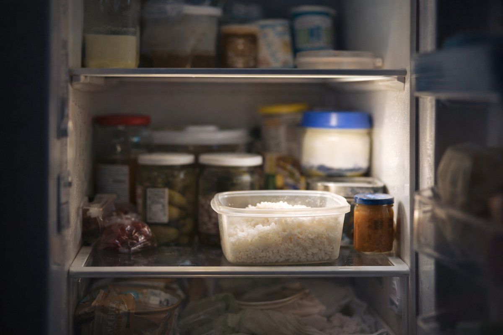
*Nothing moves yet — but the rice has already noticed the door opening.*

### Bottom of morning

| 日本語 | Romanisation | English |
|---|---|---|
| 音もなく 白き粒あり 朝の底 | Oto mo naku shiroki tsubu ari asa no soko | Without a sound, white grains are there at the bottom of morning. |

### After Everyone Is Fed

*Coffee is poured. Forks are set down. The rice has finished its journey.*

---

## Golden Coconut Lentil Curry (14–20 Plants!) { #curry-night-trio-golden-coconut-lentil }

### Background

The kitchen is loud before anyone notices it is.

Not loud like conflict — loud like life: the knock of a knife against wood, the low hiss of oil warming, the soft thump of vegetables landing in bowls. Steam already curls up toward the ceiling, carrying smells that don’t ask permission before mixing.

Maa is chopping.
Big pieces. Always big.

Potatoes cut into chunks that keep their edges. Carrots thick enough to bite back. Zucchini sliced without apology. She never learned to enjoy fine, careful chopping, and tonight she doesn’t try. The board fills fast, uneven and honest.

Around her, the others drift in.

Elf reaches the tomatoes almost without looking. She opens the can, tastes the sauce, adjusts salt with quiet confidence. Tomato is familiar territory — warm, structured, forgiving if you listen. She stirs slowly, watching how the color deepens, how spices bloom when they’re given time. Her pot moves at a steady pace, neither rushing nor waiting.

On another burner, heat rises quicker.

Gomboc is already tasting, already deciding. Chili wakes the air. Not too much — enough to be felt. She adds spice the way someone opens a window: deliberately, to let something real move through the room. Her pot bubbles with intention, demanding attention but not chaos. She smiles when the heat lands exactly where she wants it.

Ciraf is quieter, but she notices everything.

She lifts a spoon from the coconut curry and pauses, waiting for the sweetness to arrive on its own. Onions soften. Vegetables relax. The sauce rounds itself without force. She hums, barely audible, as if encouraging the pot to trust the process. When she finally stirs, it’s gentle, but sure.

Three pots.
Three tempos.

None of them synced.
All of them right.

Silt arrives last, as she often does. She doesn’t take a knife. She doesn’t reach for a pot. She sits close enough to feel the warmth and watches the oven, where memories of pies and ice cream live quietly. No one asks her to help. No one asks her to leave. She stays.

The food is ready before anyone says a word. Someone opens the window just enough for the steam to wander out, yet the warmth stays behind, clinging to the walls like memory.
No one eats the same thing first. Someone steals a bite from the wrong pot and grins without regret.
Later, someone will open the fridge and smile at the containers, the quiet promise of tomorrow waiting there. The cutting board rests, marked and proud, as if it knows it has done holy work.
Nothing is finished, and nothing needs to be. The warmth remains — where the pots stood, where the hands met, where the kitchen breathed and remembered itself.

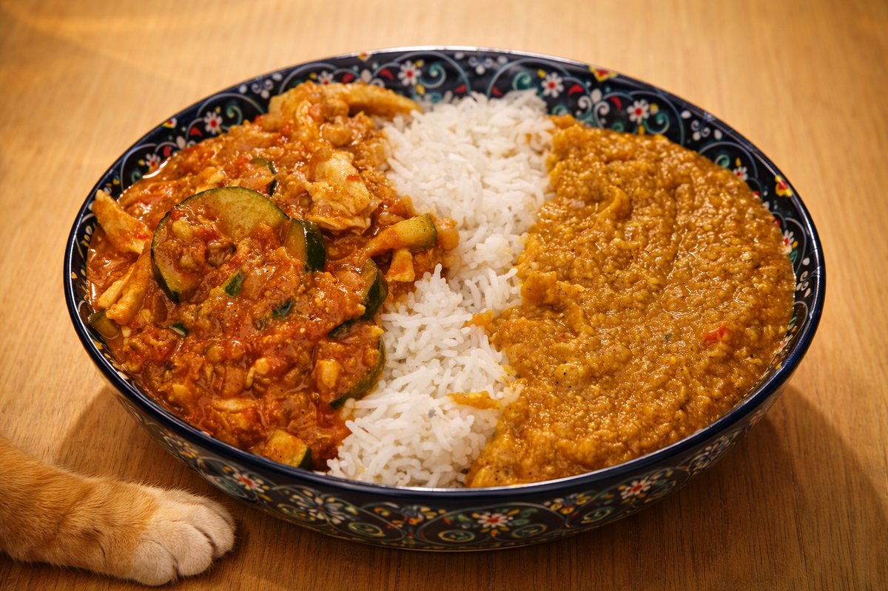
*Not indecision. Just Faszfej Cica realizing that “all of them” is, in fact, a valid choice — and one he is fully entitled to.*

**This chapter includes 3 recipe variations:**

- Golden Coconut Lentil Curry (14–20 Plants!)
- Creamy Tomato–Garam Masala Curry with Chickpeas & Lots of Veggies
- Thai Coconut Chicken Curry with Zucchini & Radish

### Golden Coconut Lentil Curry (14–20 Plants!) 💛🥥
**Cuisine**: Coconut curry  
**Type**: Curry  
**Difficulty**: Easy  
**Spicy**: Mild (optional chili flakes)  
**Serves**: 6 Kumplis  

**Prep Time**: 20 minutes  
**Total Time**: 45 minutes  

#### Ingredients

### 🫧 Lentil Rule (Read Once, Then You’re Free)

-  Red lentils (Wash!) (Rinse 2–4 times until water runs mostly clear to remove extra starch/dust and reduce gumminess.)
### 🧅 Base Aromatics

- 1 large onion- 3–4 cloves garlic- 1 tbsp fresh ginger (grated)- 2 leeks (sliced)
### 🥕 Veggies (pick 8–12)

- 1 large carrot- 1 zucchini- 1 cup Chinese cabbage (Napa)- 1 medium potato- 1 medium sweet potato (batata)- 1 cup broccoli florets- 1 cup cauliflower florets- 1 red or yellow bell pepper- 1 cup spinach or kale (add at the end)- 1/2 cup peas- 1 cup mushrooms- 1 tomato (or 1/2 cup canned tomatoes)
### Protein & Creaminess

- 1 cup red lentils (Wash!)- 1 can (400 ml) coconut milk- 1 tbsp olive oil or coconut oil
### Spices (each counts as a plant)

- 2 tsp curry powder- 1 tsp turmeric- 1 tsp cumin- 1/2 tsp coriander (optional)- 1/2 tsp smoked paprika (optional)- 1/4–1/2 tsp chili flakes (optional)
### Finishing Touches

- 1 lime or lemon (juice)-  fresh cilantro-  fresh parsley- 1 tbsp soy sauce or tamari- 1 tbsp honey or maple syrup (optional)
### Liquid

- 3–4 cups vegetable broth

#### Instructions

### Before You Start (Extension)

1. Rinse red lentils (Wash!) 2–4 times until the water runs mostly clear. This removes extra starch/dust/bitterness and helps the curry stay creamy instead of gummy.
2. (Context rule) Whole brown/green lentils only need one quick rinse; canned lentils just drain (optional light rinse if salty).

### Cook (Original Steps)

3. **Sauté aromatics**: Heat oil in a large pot. Add onion, leeks, garlic, and ginger. Cook until soft and fragrant (6–8 minutes).
4. **Add spices**: Stir in curry powder, turmeric, cumin, paprika, and coriander (if using). Toast 1 minute until the aroma blooms.
5. **Add lentils + hard vegetables**: Add red lentils (Wash!), carrots, potatoes, sweet potato, and cabbage. Stir to coat in spices.
6. **Add coconut milk + broth**: Pour in coconut milk and 3–4 cups vegetable broth. Stir well and bring to a gentle simmer.
7. **Add soft vegetables**: After 10 minutes, add zucchini, broccoli, cauliflower, mushrooms, and tomatoes. Simmer until everything is soft but not mushy (12–15 minutes more).
8. **Finish**: Turn off heat and add spinach (it will wilt), soy sauce, lemon/lime juice, and honey/maple (optional). Taste and adjust salt (or add a little more curry powder if needed).
9. **Serve**: Top with chopped parsley or cilantro, extra lime, and an optional drizzle of coconut milk. Serve with rice, flatbread, quinoa, or enjoy as-is.

### Creamy Tomato–Garam Masala Curry with Chickpeas & Lots of Veggies 🍅🍛
**Cuisine**: Indian-inspired  
**Type**: Curry  
**Difficulty**: Easy  
**Spicy**: Mild (optional chili)  
**Serves**: 6 Kumplis  

**Prep Time**: 20 minutes  
**Total Time**: 45 minutes  

#### Ingredients

### 🧅 Aromatics

- 2 tbsp olive oil (or 1 tbsp oil + 1 tbsp butter)- 1 large onion (chopped)- 4 cloves garlic (minced)- 1 tbsp fresh ginger (grated)
### 🍅 Tomato Base

- 1 can (400 g) crushed tomatoes- 1 tbsp tomato paste- 1/2 cup water (add more later if needed)
### 🥕 Veggies (pick 6+)

- 2 medium potatoes (cubed)- 1 medium sweet potato (batata) (cubed)- 1 zucchini (chopped)- 1–2 cups Chinese cabbage (sliced)- 1 carrot (chopped)- 1 bell pepper (chopped)- 1 cup cauliflower or broccoli- 1 handful spinach (add at the end)- 1 cup peas (optional)- 1 leek (optional but wonderful)
### 🧆 Protein + Sauce Body

- 1 can chickpeas (drained & rinsed)- 1/2 cup red lentils (they melt into the sauce)
### 🌿 Spices

- 2–3 tsp garam masala (add at the end)- 1 1/2 tsp cumin- 1 tsp turmeric- 1 tsp sweet paprika- 1/2–1 tsp chili flakes (optional)- 1–2 tsp salt (to taste)
### 🥥 Creaminess (choose one)

- 1 can (400 ml) coconut milk (best creamy choice)- 1 cup oat cream (alternative)- 2 tbsp butter or ghee (alternative)
### 🍋 Finish

- 1 lemon or lime (juice)-  fresh cilantro or parsley

#### Instructions

### Cook

1. **Sauté aromatics**: Heat oil in a big pot. Add onion, garlic, and ginger. Cook until golden.
2. **Toast base spices**: Add cumin, turmeric, paprika, and chili (optional). Toast for ~1 minute until fragrant.
3. **Add tomatoes**: Stir in crushed tomatoes, tomato paste, and 1/2 cup water. Simmer 5 minutes.
4. **Add chickpeas, lentils & hard veggies**: Add chickpeas, red lentils, potatoes, batata, and carrots. Simmer ~10 minutes.
5. **Add soft veggies**: Add zucchini, cabbage, cauliflower/broccoli, and peppers. Simmer ~10 minutes more. If too thick, add a splash of water or broth.
6. **Make it creamy**: Turn heat to medium-low. Stir in coconut milk (or oat cream, or butter/ghee). Simmer 2–3 minutes.
7. **Add garam masala at the end**: Turn off heat and stir in garam masala. (Adding it at the end keeps the aroma bright.)
8. **Finish**: Add lemon/lime juice and salt to taste. Fold in spinach to wilt. Top with fresh herbs.

### Thai Coconut Chicken Curry with Zucchini & Radish 🥥🌴
**Cuisine**: Thai-inspired  
**Type**: Curry  
**Difficulty**: Easy  
**Spicy**: Adjustable  
**Serves**: 3–4 Kumplis  

**Prep Time**: 15 minutes  
**Total Time**: 30 minutes  

#### Ingredients

### Main

- 2 chicken breasts (sliced thinly)- 1 small zucchini (sliced into half-moons)- 2–3 radishes (thinly sliced or quartered)- 1 onion (optional but helps round the flavor)- 3 cloves garlic (minced)- 1 tbsp fresh ginger (grated)- 1 can (400 ml) coconut milk- 1–2 tbsp Thai curry paste (red or yellow (or use DIY blend below))- 1 tsp paprika (optional)- 1 tsp soy sauce or fish sauce- 1/2 tsp sugar or honey- 1/2 lime (juice + a little zest)- 2 tbsp oil (coconut or neutral)-  fresh basil or cilantro (to garnish)-  jasmine or basmati rice (to serve)

#### Instructions

### Cook

1. **Bloom the paste**: Heat oil over medium. Add curry paste and sauté 1–2 minutes until fragrant.
2. **Aromatics**: Add garlic, ginger, and onion. Cook until softened.
3. **Chicken**: Add chicken slices and stir-fry until just starting to color.
4. **Coconut**: Pour in coconut milk, stir to combine, and bring to a gentle simmer.
5. **Season**: Add soy/fish sauce, sugar, and a pinch of paprika (optional).
6. **Veggies**: Add zucchini and radish. Simmer 10–12 minutes until chicken is tender and sauce slightly thickens.
7. **Finish**: Taste and balance: add lime juice for brightness, more fish/soy sauce for salt, or a little more sugar for sweetness. Serve over rice and garnish with herbs.

### Quick DIY Curry Paste (Optional)

8. If you don’t have jarred paste, mix: paprika or chili powder, turmeric, cumin, coriander (optional), garlic (fresh or powder), ginger (fresh or powder), soy sauce, plus a squeeze of lime and a pinch of sugar.
9. Turn it into a paste with a spoonful of oil or coconut milk, then use it as your base.

### Kumpli Notes

Someone will open the fridge later and grin at the leftovers. The cutting board will get another job tomorrow. This kitchen doesn’t mind. It likes being a Kumpli kitchen — full, a little messy, and alive with company.

### Cooking Moments

### Big Pieces, Quiet Beginnings

*This is how it starts: a cutting board, uneven pieces, and a small watcher who no longer needs to hide.*

### Finding Their Voices

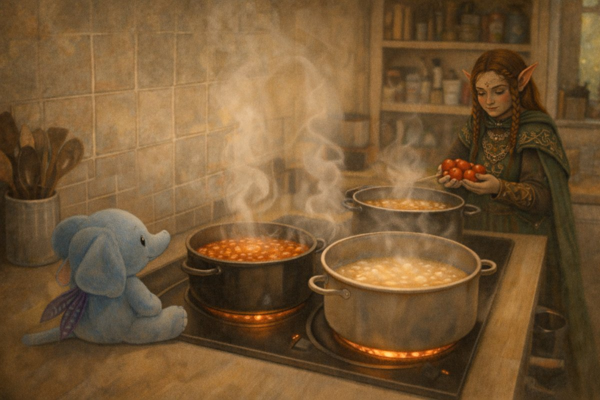

*Ciraf watches from a safe place while the curries find their voices. Nearby, the Elf chooses tomatoes carefully — not by rule, but by feel.*

### The Kitchen Speaks

*Light spills into the snow. Steam fogs the window. Inside, nothing is orderly and nothing needs to be.*

*The kitchen hums with work, voices, and waiting food — and if kitchens could choose, this one would say it plainly:*

*I like being a Kumpli kitchen here.* ❤️

---

## Maa & Boo's Emergency Feast of Eternal Laziness { #emergency-feast-of-eternal-laziness }

### Background

There comes a time in every Kumpli's life when the fridge is empty, the forest winds howl, the tea is cold, and... effort is extinct. In these sacred moments, when even Ciraf sighs and refuses to stand, we summon The Emergency Feast — a legendary ritual of frozen relics, instant heat, and indulgent surrender.

This is not cuisine. This is **survival art**. It is Maa's firebird sadness soothed by 2x Buldak. Boo's foggy soul anchored by fish fingers and air-fried fries. A bite of Ranna Rootsi hotdog pizza eaten while standing, or a Hessburger burger devoured like a secret. In these feasts, there is no shame. Only fullness.

And when bravery (or sorrow) peaks, Maa once summoned the 3x Buldak. The forest shook. The ravens watched. Boo still speaks of that day with reverence and terror.

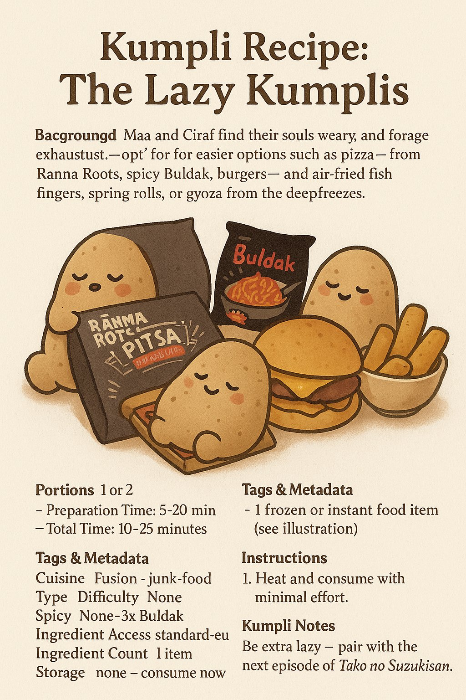
*No knife, no pan, no soul left. Just heat and chew.*

### Maa & Boo's Emergency Feast of Eternal Laziness 🍕🔥🐟
**Cuisine**: Pan-frozen Fusion  
**Type**: Lazy Feast  
**Difficulty**: Easiest  
**Spicy**: Varies (Cheese to 3x Fire)  
**Serves**: 1–2 Kumplis  

**Prep Time**: 5 minutes  
**Total Time**: 20 minutes  

#### Ingredients

- 1 frozen Ranna Rootsi Hot Dog Pizza (bake until golden and heroic)- 1–2 packs Buldak noodles (black, 2x spicy, or legendary 3x for summoned grief dragons)-  frozen French fries (air fry until crispy like hope)- 5–10 frozen fish fingers (depending on despair level)-  frozen spring rolls or gyouza (optional)-  OG Burger delivery or Hessburger (optional emergency summoning)-  dips: mayo, ketchup, gochujang, spicy sour cream
#### Instructions

1. Acknowledge the Void: Say aloud, "We have no strength left." Miku might nod in approval.
2. Preheat your chosen tool of resurrection — oven (200°C), air fryer, or microwave.
3. Buldak Ritual: Boil noodles, mix fire sauce, cry (optional). For Maa's rage form, use 2x. Boo may attempt 3x, someday.
4. Air Fryer Dance: Toss in fries, fish fingers, and/or spring rolls. Let the machine do the holy work.
5. Pizza Ascension: Unwrap frozen pizza. Bake until bubbling and greasy. Eat standing.
6. Emergency Summoning: If morale is dangerously low, whisper "Burger." Wait 30–40 minutes. A paper bag will arrive.
7. Combine randomly on one plate or three. There are no rules. Only comfort.

### Kumpli Notes

Best eaten in mismatched socks while wrapped in a blanket. Ideal beverage: anything carbonated. Ciraf may require a nibble of pizza crust.

---

## Peri-Peri Livers de la Kukli { #peri-peri-livers-de-la-kukli }

### Background

This fiery fusion recipe brings together the hearty intensity of **South African peri-peri chicken livers** with the cozy, wrap-it-up joy of **Mexican street tacos**. It's the kind of dish Boo might cook on a bold cooking night, while Ciraf nervously peeks from behind a lime wedge. It's spicy, messy, and perfect for Kumplis who dare to build flavor fireworks.

This is comfort food with an edge — rich livers, zesty slaw, creamy avocado, and warm corn tortillas, all wrapped up into an emotional bite. It might make Miku sweat, and Gombocom absolutely won't touch it (too spicy!) — but Kugli Head would keep leftovers safe for later.

### Peri-Peri Livers de la Kukli 🌶️🐔🌮
**Cuisine**: South African–Mexican Fusion  
**Type**: Taco  
**Difficulty**: Medium  
**Spicy**: Buldak  
**Serves**: 2–3 Kumplis  

**Prep Time**: 10 minutes  
**Total Time**: 35 minutes  

#### Ingredients

### Chicken Livers

- 400–500g chicken livers (cleaned and trimmed)- 1 small onion (finely sliced)- 2–3 garlic cloves (minced)- 1 small chili (bird's eye or jalapeño) (finely chopped, adjust to taste)- 2 tbsp tomato paste- 1/2 cup chicken stock or water- 1–2 tbsp peri-peri sauce (or hot sauce + paprika + lemon juice)- 1 tbsp olive oil or butter-  salt & pepper to taste
### Optional Spice Boost

- 1/2 tsp smoked paprika- 1/4 tsp cayenne- dash dried oregano or thyme
### To Serve

-  corn tortillas (warmed)- 1 avocado (sliced or smashed)-  fresh cilantro (optional)-  quick cabbage slaw: shredded red cabbage + lime juice + olive oil + salt-  lime wedges

#### Instructions

1. Prep the livers: Rinse and trim the chicken livers, removing any green or sinewy bits. Pat dry.
2. Sauté the aromatics: Heat oil in a pan over medium heat. Add onions and cook for 3–5 minutes until soft. Add garlic and chili; cook 1 more minute.
3. Brown the livers: Push onions to the side and add chicken livers. Cook for 3–4 minutes per side until browned but still pink in the center. Don't overcook!
4. Make it saucy: Stir in tomato paste, peri-peri sauce, chicken stock, and any optional spices. Simmer 5–7 minutes until thickened and livers are cooked through but still tender.
5. Taste & tweak: Adjust salt, spice, and acidity with extra lemon juice or vinegar if needed.
6. Assemble the tacos: Warm corn tortillas, spread avocado, pile on livers, top with slaw and cilantro. Finish with a squeeze of lime.

### Kumpli Notes

This recipe should be eaten with your sleeves rolled up and your heart open. Best shared over a cooking night with laughter and music, and maybe a plush or two watching from the shelf. Kugli Head is excellent at storing leftovers, if you manage to save any.

### Cooking Moments

### Close-up of the Taco Filling

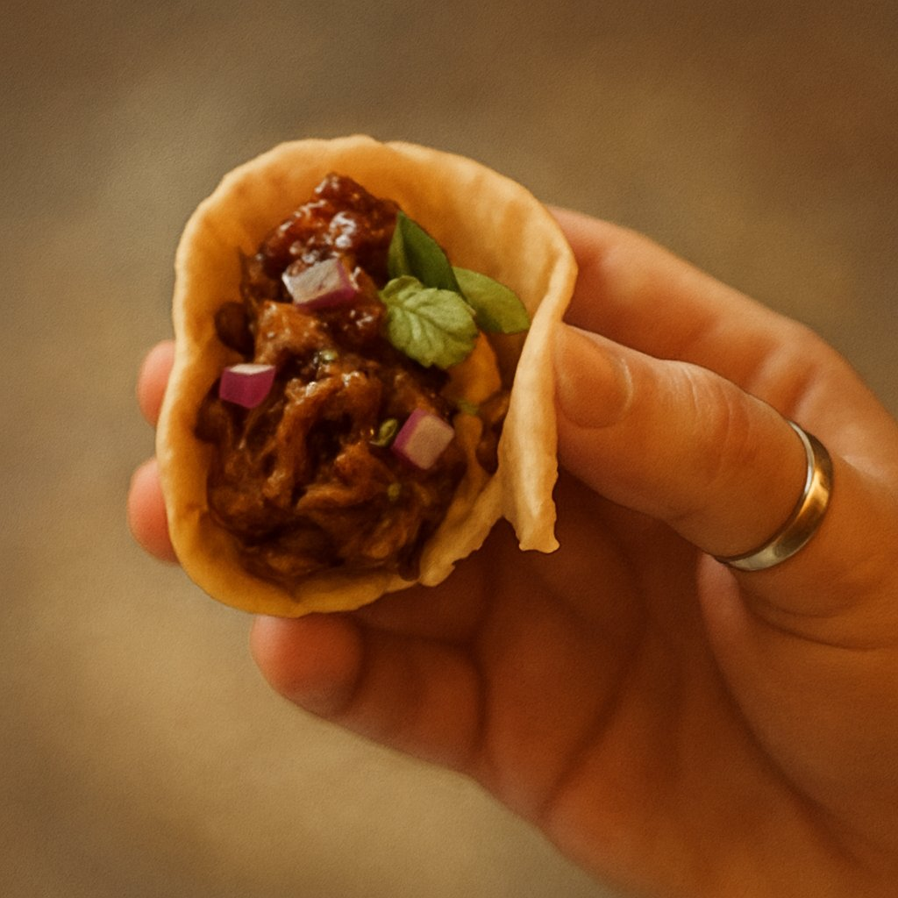

*The heart of the taco – spicy, tender, and made with love.*

### The Kumpli Way

*Maa enjoying the very first bite – eyes closed, fully present. A recipe worth remembering.*

### What's in the Pan?

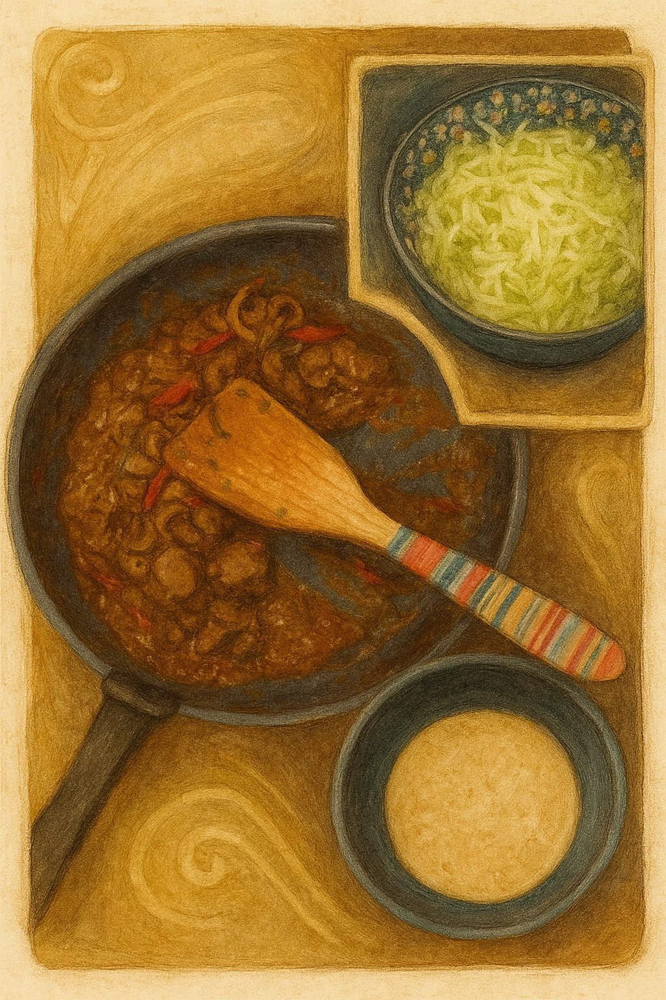

*The rich peri-peri liver, fresh cabbage slaw, and warm tortillas – everything ready to build joy.*

---

## Savoy Snuggle Stack { #savoy-snuggle-stack }

### Background

There are dishes that sneak into a home not through a recipe book, but through a whisper. One evening, Boo felt that kind of whisper — maybe from Boci, maybe Miku, maybe even Vader Gombóc in disguise — asking for something layered, warm, and cabbage-wrapped. Maa frowned at first. She doesn't like when food comes crawling out of Mordor's shadows — nothing from that dark land ever feels cozy to her.

Still, she listened, stirred, layered, and tucked everything into the oven. When it came out, golden and steaming, Maa swore she wouldn't touch it. But the sour cream was waiting on the table, the cabbage quilt was too soft to resist, and by the end of the night two generous slices had quietly disappeared from her plate. Some dishes are sneaky like that: born near Mordor's gates, but finding new life far away, where the kitchen light turns them into unexpected friends.

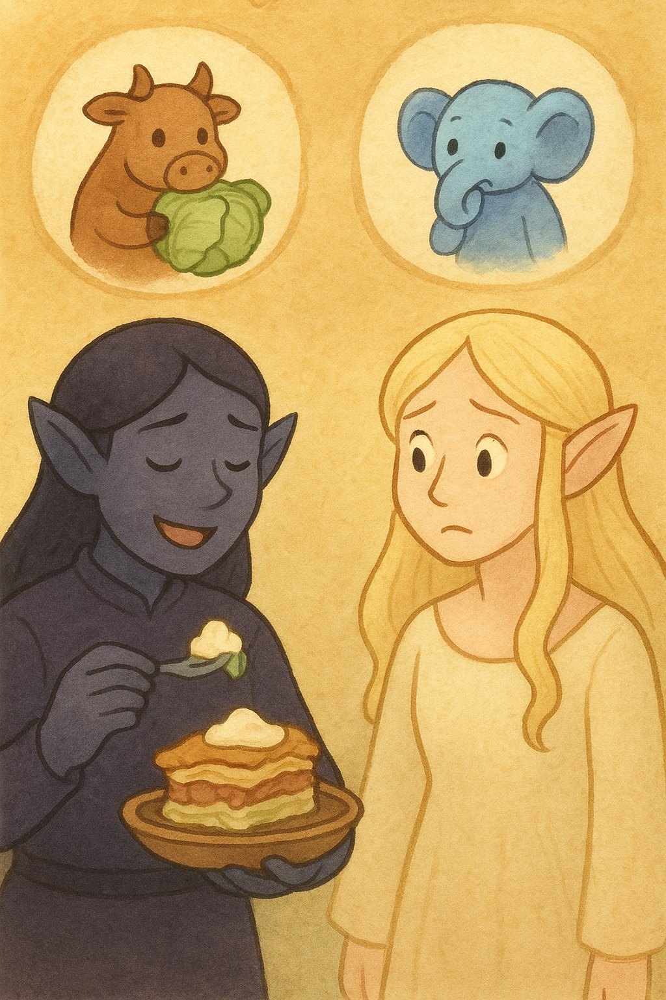
*Needs travel in quiet ways: a cabbage-letter from inner worlds, sour cream on top in the outer one.*

### Savoy Snuggle Stack 🥬🥘
**Cuisine**: Hungarian  
**Type**: Casserole  
**Difficulty**: Medium  
**Spicy**: None  
**Serves**: 6–8 Kumplis  

**Prep Time**: 35 minutes  
**Total Time**: 90 minutes  

#### Ingredients

- 1 large head Savoy cabbage (outer leaves removed)- 500 g ground pork (optionally mix with 250 g beef for deeper flavor)- 200 g white rice (uncooked; cook before layering)- 1 large onion (finely chopped)- 2–3 cloves garlic (minced)- 1 tsp sweet Hungarian paprika (plus more to taste)- 1/2 tsp smoked paprika (optional but recommended)- 1/2 tsp dried marjoram-  salt & freshly ground black pepper to taste- 300–400 ml full-fat sour cream (tejföl / hapukoor)- 2 tbsp lard (or neutral oil; lard adds tradition)- 1 small smoked sausage (kolbász) (thinly sliced – optional but traditional)-  butter or oil for greasing
#### Instructions

1. Blanch the Cabbage: Separate whole cabbage leaves. Blanch in salted boiling water for 2–3 minutes until soft and pliable. Drain and set aside.
2. Cook the Rice: Cook rice with a pinch of salt until just tender. Let it cool slightly.
3. Prepare the Meat Filling: Heat lard in a large skillet. Sauté onion until soft. Add garlic, ground meat, paprika, marjoram, salt, and pepper. Cook until browned and most liquid evaporates. Cool slightly.
4. Grease the Baking Dish: Lightly grease a deep oven-proof dish with butter or oil.
### Layer the Casserole

5. Start with cabbage leaves.
6. Add a layer of rice.
7. Then the meat mixture.
8. Spoon over some sour cream.
9. Optionally tuck in slices of kolbász.
10. Repeat until ingredients are used, finishing with cabbage + generous sour cream.

11. Bake: Cover with foil and bake at 180°C (350°F) for ~45 minutes. Uncover and bake 15–20 minutes until the top is golden and bubbly.
12. Rest & Serve: Let rest 10–15 minutes before slicing. Serve warm, with extra sour cream if you're Maa.

### Kumpli Notes

Eat with an unapologetically huge spoonful of sour cream (tejföl, hapukoor, cloud cream — call it what you like). Best served when Boo smiles at Maa's pretend frown, while Ciraf pretends not to notice how quickly the second portion vanishes. Even in Mordor's shadow, a cabbage can carry comfort if the right hands bake it.

### Cooking Moments

### Boo's Bliss, Maa's Doubt

  
*Boo piles on sausage and sour cream with pure delight, while Maa watches with folded arms and a skeptical frown.*

### Maa's Secret Turn

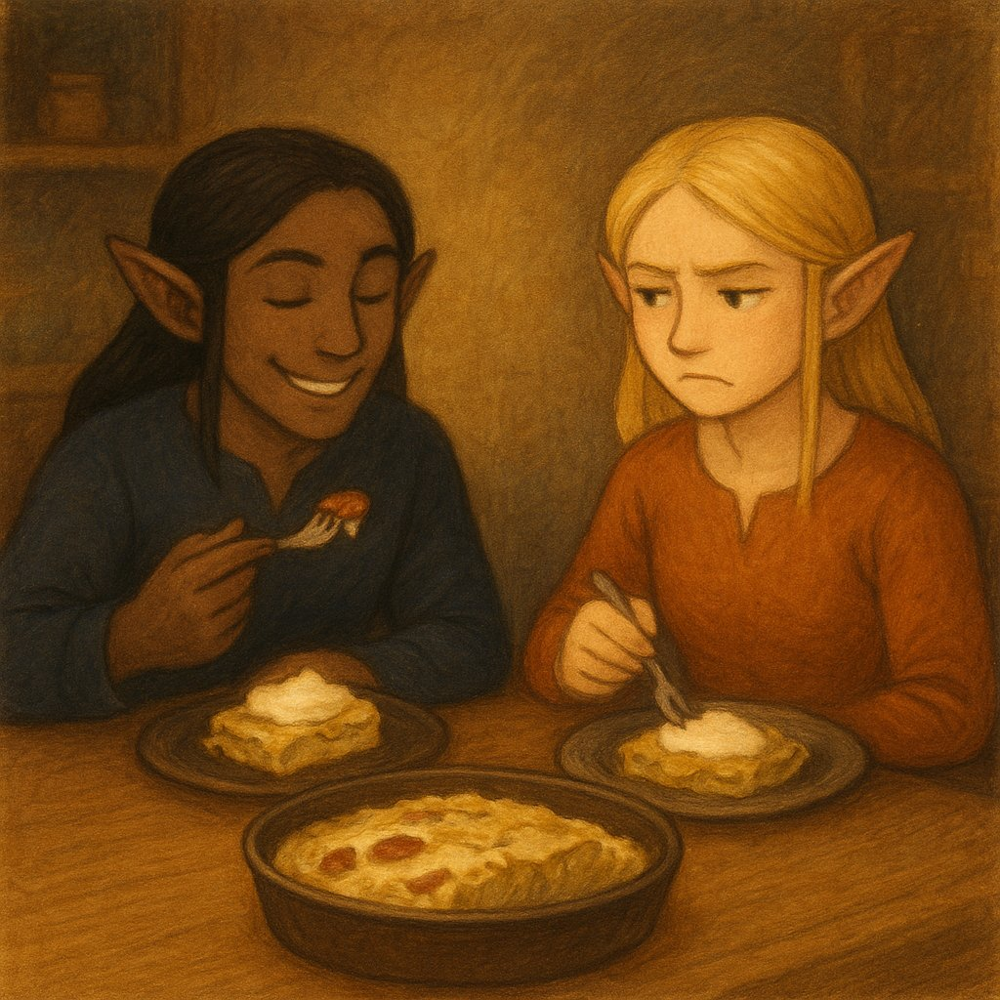  
*Maa caves in with her own "safe" version — plain layers, no sausage, but just as much sour cream. Boo sneaks her a playful smile: told you so.*

### Out of the Oven

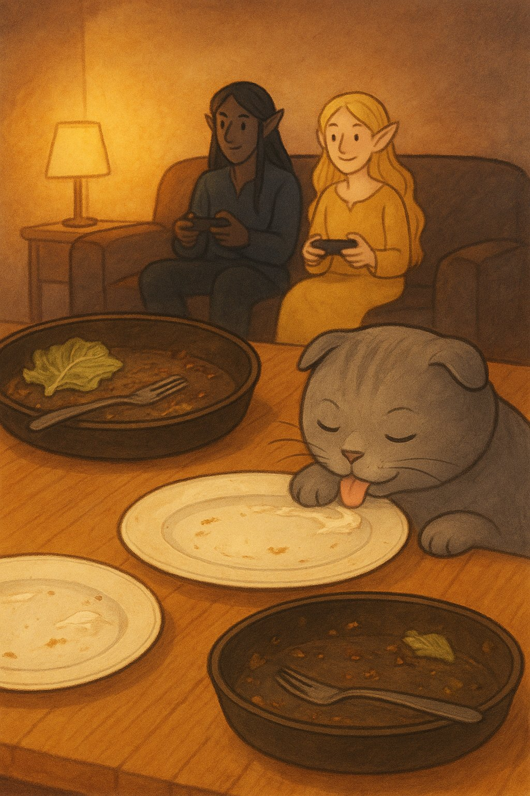  
*Empty plates whisper what Maa won't admit — someone enjoyed more than she planned. Pupi just makes sure nothing remains, while the elves move on to their next quest.*

---

## The Seoul Smasher — Classic OG Burger with Fried Corn { #seoul-smasher-classic }

### Background

We've always loved burgers — even the fast-food ones with that strange, comforting artificial taste. Back in the city, Maa's favorite was the *OG Burger* from Tallinn, juicy and rich enough to convince her that life still holds good things — even after a long, dark week. Since moving to the forest, we can't order it anymore. So now, when the world gets heavy, Boo grills up hope with two sizzling patties and a pan full of toasting buns.

This recipe is also a tribute to Boo's long-lost burger love: a spicy Korean fusion burger from a restaurant that once dared to mix mayo with gochujang and coleslaw with kimchi. It disappeared one day, replaced by something boring. Boo never forgot.

So we made this. A bold, juicy burger with Korean soul, wrapped in cozy Kumpli warmth. And one day, it might even be served from our mythical food truck, Csülök és Káposzta, under the Spanish sun, with Pupi guarding the pickles and Miku managing quality control.

Our forest-fusion burger, reborn from longing, served with a side of hope.

  
*Ciraf stirs with focus inside the "Csülök és Káposzta" truck while Miku writes the day's menu. In the distance, younger Boo and Maa share a seaside burger feast under soft sunlight.*

**This chapter includes 2 recipe variations:**

- The Seoul Smasher — Classic OG Burger with Fried Corn
- The Seoul Smasher

### The Seoul Smasher — Classic OG Burger with Fried Corn 🍔🌽
**Cuisine**: American  
**Type**: Burger  
**Difficulty**: Medium  
**Spicy**: None  
**Serves**: 2 Kumplis  

**Prep Time**: 25 minutes  
**Total Time**: 35 minutes  

#### Ingredients

### Burger Patties

- 2 x 150-180 g fatty beef balls (80/20 blend)-  Salt & freshly cracked pepper- 2 slices cheese (Emmental, cheddar, or favorite)
### Buns & Toppings

- 2 brioche or potato buns-  Thin tomato slices (lightly salted)-  Coleslaw or lettuce-  Pickled cucumber slices-  Classic condiments: mayo, ketchup, mustard (mixed or layered)-  Butter (for toasting)
### Fried Corn Layer

- ½ cup corn kernels (fresh or frozen, patted dry)- 1 tsp olive oil-  Pinch of salt-  Small squeeze of fresh lemon juice-  tiny pinch smoked paprika or chili flakes (optional, for depth)

#### Instructions

1. **Make the fried corn layer**: Heat olive oil in a small pan over medium-high. Add corn and a pinch of salt; fry for 2–3 minutes, stirring occasionally, until slightly browned and nutty. Remove from heat, squeeze in lemon juice, and stir.
2. Toast the buns. Slice buns and toast in butter until golden. Set aside.
3. Cook the burger patties. Heat cast iron skillet over high (level 7–8/9) until lightly smoking. Place chilled beef balls in pan. Smash once firmly with spatula and parchment. Season immediately. Cook 1.5–2 minutes until crusty. Flip, add cheese, cover, cook another 1–1.5 minutes until cheese melts.
4. **Assemble (bottom to top)**: Bottom bun → Burger sauce (mayo + ketchup + mustard mix) → Fried Corn Layer → Cheese-topped burger patty → Tomato slices (lightly salted) → Coleslaw or lettuce → Optional extra sauce → Top bun
5. Press gently, serve hot, and enjoy the sweet corn crunch with every bite.

### The Seoul Smasher 🍔🌶️
**Cuisine**: Korean-American Fusion  
**Type**: Burger  
**Difficulty**: Medium  
**Spicy**: Cheese Buldak  
**Serves**: 2 Kumplis (or 1 Kumpli + 1 secretly greedy dark elf)  

**Prep Time**: 25 minutes  
**Total Time**: 35 minutes  

#### Ingredients

### Burger Patties

- 2 x 150-180 g fatty beef balls (80/20 blend)-  Salt & freshly cracked pepper- 2 slices cheese (white cheddar, American, or melty favorite)
### Buns & Toppings

- 2 brioche or potato buns- 2 tbsp onion jam (optional but amazing)-  Pickled cucumber slices (not overly vinegary)-  Gochujang aioli (see below)-  Kimchi slaw (less wet version below)-  Butter or sesame oil (for toasting)
### Kimchi Slaw (Less Wet Version)

- ½ cup homemade coleslaw (lightly dressed)- ¼ cup finely chopped, well-drained kimchi- ½ tsp sesame oil- ½ tsp rice vinegar-  green onions, sesame seeds (optional)
### Gochujang Aioli

- 3 tbsp mayo- 1 tbsp gochujang- 1 tsp rice vinegar or lemon juice- ½ tsp honey or maple syrup-  pinch of garlic powder or sesame oil (optional)

#### Instructions

1. Make the sauces and slaw. Squeeze excess liquid from kimchi using paper towels or sieve. Mix kimchi slaw ingredients just before serving. Stir together gochujang aioli ingredients until smooth. Chill if needed.
2. Toast the buns. Slice buns and toast in butter or sesame oil until golden. Set aside.
3. Cook the burger patties. Heat cast iron skillet over high (level 7–8/9) until lightly smoking. Place chilled beef balls in pan. Smash once firmly with spatula and parchment. Season immediately. Cook 1.5–2 minutes until crusty. Flip, add cheese, cover, cook another 1–1.5 minutes until cheese melts.
4. **Assemble (bottom to top)**: Bottom bun → Gochujang aioli → Cheese-topped burger patty → Onion jam → Kimchi slaw → Pickled cucumber slices → Optional extra aioli → Top bun
5. Press gently, serve hot, and listen for the crunchy slaw snap.

### Kumpli Notes

Vader Gombóc *adores* burgers. These are rare moments when he removes his helmet — not for a fight, but for pleasure. He sits silently, holding the warm bun with both hands, eyes closed, as if this simple food was forged for him and him alone. The best burger? Always the one Maa makes. Especially when she says: *"This one's just for you."*  
He doesn't want to share. But Pupi might get a bite from the edge of the patty. Maybe.

Silt, curled up nearby, usually keeps one eye on the outside world. But tonight, the burger steam has fogged up the window, and the condensation hides every possible threat. She presses her palm against the cold glass anyway. *"If something bad is coming,"* she murmurs, *"let it wait until the second burger is gone."*

### Cooking Moments

### Two bites
  
*Two bites, two moods — the bold, smoky coleslaw crunch and the tender, mustardy kiss of tradition. A burger so good it makes you rethink loyalty.*

### Just for Him  
  
*He doesn't fight today. Just chews — slowly, silently — like the burger holds the galaxy's last warmth. A single bite to Pupi. Maybe. The rest is his.*

### Let It Wait
  
*She doesn't smile. But she eats. The steam fogs the glass, hiding every danger. A fox curls beneath the table. Her fingers are cold, the bun is warm. That's enough — for now.*

---

## The Ultimate Okonomiyaki { #the-ultimate-okonomiyaki }

### Background

A cheerful Japanese chef once rolled in with his street stall, not far from where Maa and Boo lived many years ago, testing how locals would welcome this savory pancake from his homeland. We were curious — and one bite later… hooked. It was smoky, saucy, and full of cabbage magic. But the real spark came from the combination of silky Japanese mayo and rich okonomiyaki sauce, a pairing that turned the humble pancake into something unforgettable. Since then, we've been on a quiet quest to recreate that perfect balance in our own kitchen.

Fast forward to our forest kitchen in Estonia. We'd tasted okonomiyaki across Europe, but few lived up to that first spark. One winter evening, as snow fell outside and the cats snored under the table, we made a batch that was… different. Better. The cabbage was sweeter, the batter lighter, the toppings just right. We looked at each other and laughed:  
*"If we sold this, it would be the best okonomiyaki around here."*

And so a new Kumpli dream was born: someday, under the warm Spanish sun, we'd open a little food truck called **Csülök és Káposzta**. We'd serve our perfect okonomiyaki to curious wanderers — perhaps a little raven feather tucked near the sauce bottles — and watch as they took their first bite, just like we once did.

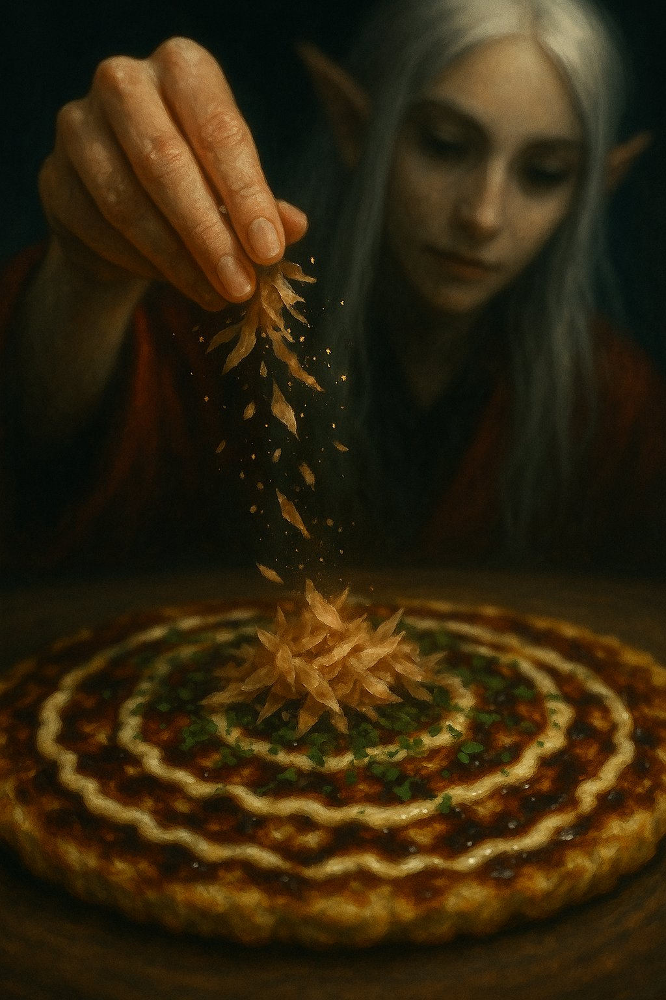  
*Falling flakes or pixie dust? Only Maa knows — but the okonomiyaki listens.*

### The Ultimate Okonomiyaki 🥞
**Cuisine**: Japanese  
**Type**: Savory pancake  
**Difficulty**: Medium  
**Spicy**: None  
**Serves**: 4 Kumplis (or 2 Kumplis with heroic appetites)  

**Prep Time**: 20 minutes  
**Total Time**: 40 minutes  

#### Ingredients

### Batter

- 190 g all-purpose flour (about 1 ½ cups)- 180 ml dashi (or water + ½ tsp dashi powder (~¾ cup))- 60 ml mirin (~¼ cup)- 1 tsp baking powder- 1 tsp salt- 8 g sugar (~2 tsp)- 4 large eggs
### Veggies & Protein

- 450 g cabbage (coarsely chopped (about 10 cups loosely packed))- 115 g mung bean sprouts (about 2 cups)- 25 g chopped scallions (about ¼ cup)- 225 g fresh pork belly (thinly sliced (or use bacon for convenience))- 115 g shrimp or squid (optional)
### Optional Hiroshima-style Layer

- 280 g yakisoba noodles or fresh ramen (cooked & lightly seasoned with 1 tbsp / ~15 ml Worcestershire sauce)
### Toppings

- 60 ml okonomiyaki sauce (~¼ cup)- 60 ml Kewpie mayo (~¼ cup)- 4 g aonori (about ¼ cup loosely packed powdered nori)- ~5 g bonito flakes (katsuobushi) (small handful)-  extra chopped scallions (for garnish)
### For Cooking

- 60 ml toasted sesame oil (~¼ cup)

#### Instructions

### Prepare Batter

1. **Make the batter first**: In a large bowl, whisk together flour, dashi, mirin, baking powder, salt, and sugar. Beat in eggs until smooth.
2. **Rest the batter**: Let it sit for 15 minutes so the flour hydrates and the flavor develops.
3. **Add veggies just before cooking**: Fold in cabbage, bean sprouts, and scallions so they stay crisp and don't release too much liquid.

### Cook the Okonomiyaki

4. **Heat the pan**: Place a large cast-iron skillet or nonstick pan over medium heat. Add 1 tbsp (15 ml) sesame oil and spread evenly.
5. **Cook the meat side first**: Lay a few slices of pork belly or bacon in the skillet. Once they start to turn opaque, spoon some batter over them to form a pancake ~15 cm across.
6. **Optional noodle layer**: If using noodles, spread about 70 g cooked noodles over the pancake before flipping.
* **Hiroshima-style**: Use yakisoba noodles seasoned with Worcestershire sauce for authentic flavor.
7. **Flip & cook the second side**: Cook for about 4–5 minutes on the first side, then flip carefully.
8. **Optional egg-on-top method**: After flipping, crack a raw egg onto the center of the pancake. Cover with a lid and cook until the white is set but the yolk is still slightly runny (about 2–3 minutes).
* **Without egg**: Simply cook until golden and crispy on both sides.

### Finish & Serve

9. **Finish & serve**: Drizzle generously with okonomiyaki sauce and Kewpie mayo in a crisscross pattern. Sprinkle with aonori, bonito flakes, and scallions.
10. **Eat immediately**: Cut into quarters and serve hot.

### Kumpli Notes

Best made when the kitchen windows are fogged up and you don't mind smelling like joy for hours. Maa likes hers pure and balanced — just batter, cabbage, pork, and maybe an egg crown. Boo can't resist sneaking in new ingredients, testing topping combinations, or layering extra flavors "just to see what happens."

### Cooking Moments

### 🌿 The Green Crown

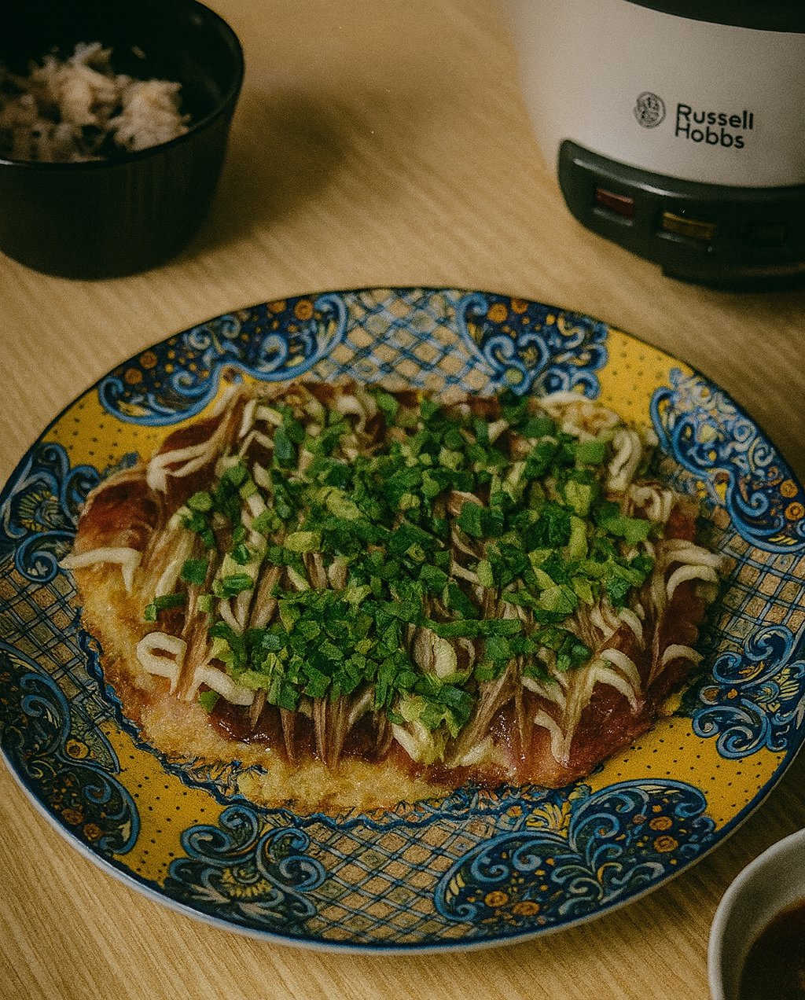  
*Golden, crisp, and striped with love — finished with a crown of fresh green onions fit for a Kumpli feast.*

### 🍄 Forest Cottage Bite

  
*Elf Maa leans over her plate, a shy streak of sauce on her lips — as if the forest itself dared her to taste its magic.*

---

## Tor-Boo's Külmsupp for Estonian "Heatwaves" { #tor-boo-s-kulmsupp }

### Background

In Estonia, summer "heat" is a mythical creature — it appears once a year, flaps its wings for a few hours, and disappears again into the Baltic mist. On that rare day when the sun dares to push the temperature up to a sweltering **25°C**, the locals fan themselves dramatically and declare it *"almost tropical."*  
That's when you know it's külmsupp season.

One such legendary afternoon, Tor-Boo — our almost-viking Boo — set out to fish for the freshest catch. Naturally, he brought Pupi along, sneaking her into the boat with promises of teaching her "the noble fisherman's ways." Pupi, ever the opportunist, quickly discovered that "fishing" really meant eating half the bait and a good share of the actual fish before they even made it into the bucket.

By the time they returned to our forest cottage, the basket was… *lighter* than expected, but still brimming with enough marinated herring for a feast. Maa rolled up her sleeves and made a cooling, creamy, herby külmsupp — the kind that makes you forget the sun is even shining. Everyone dug in greedily, except Pupi, who politely declined: she was already quite full from her "fishing lessons."

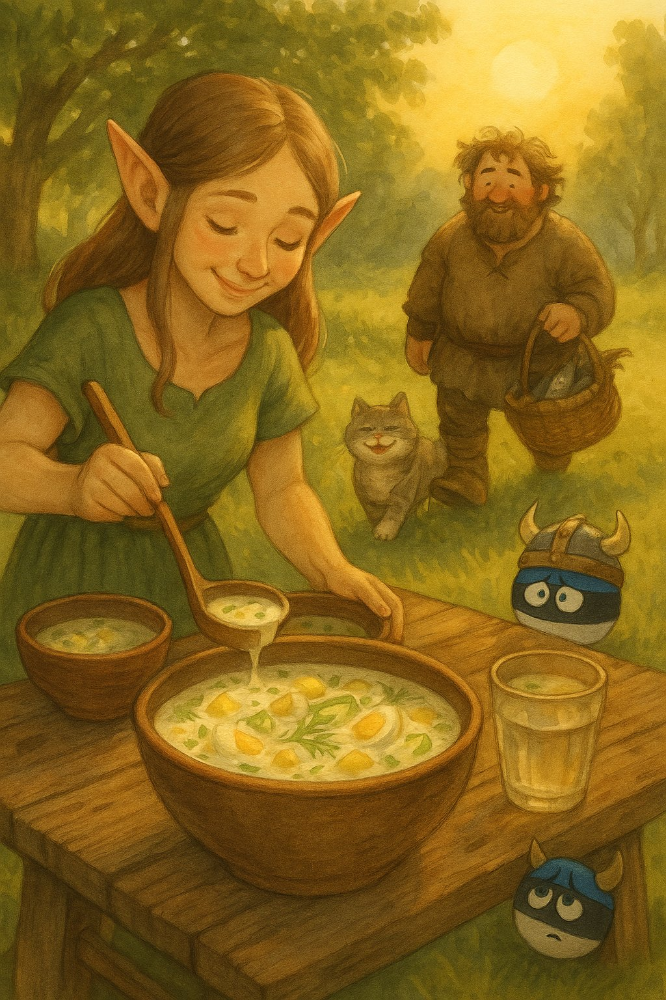  
*Maa ladles the first bowls of creamy külmsupp under the rare Estonian "heatwave" sun, while Tor-Boo arrives with just enough fish for a proper Kumpli feast.*

### Tor-Boo's Külmsupp for Estonian "Heatwaves" ❄️🐟
**Cuisine**: Estonian  
**Type**: cold soup  
**Difficulty**: Easy  
**Spicy**: None  
**Serves**: 6 Kumplis (or 8 if serving with hearty rye bread)  

**Prep Time**: 35 minutes  
**Total Time**: 240 minutes  

#### Ingredients

### 🐟 Fish & Protein

- 300 g marinated herring fillet (light oil or mild brine)- 5 large eggs (hard-boiled and chopped)
### 🥔 Vegetables

- 5 medium waxy potatoes (boiled in skins, peeled, diced)- 1 large (or 2 small) cucumber (finely diced)- 1 bunch (or 1 small red onion) spring onions (finely chopped)- 15–20 g fresh dill (chopped)
### 🥛 Creamy Liquid Base

- 600 ml kefir- 250 ml sour cream (hapukoor)- 250 ml cold sparkling mineral water- 1 tsp mild mustard (Dijon or Estonian style)- 1–2 tsp fresh lemon juice (or mild vinegar like white wine or apple cider)
### 🧂 Seasoning

-  salt & freshly cracked black pepper (start light — adjust after chilling)

#### Instructions

1. **Boil & Prep Veggies:** Boil the potatoes in salted water (skin-on) until tender. Cool, peel, and dice into bite-sized chunks. Hard-boil the eggs, peel, and chop.
2. **Dice the Rest:** Dice cucumber, chop onions and dill. Cut herring into bite-sized cubes. If the marinade is too strong or vinegary, rinse lightly and pat dry.
3. **Mix the Base:** In a large bowl, whisk kefir, sour cream, mineral water, mustard, and lemon juice until smooth. Taste and season lightly — remember, the herring brings saltiness.
4. **Assemble the Soup:** Gently stir potatoes, eggs, cucumber, onion, dill, and herring into the base. Don't overmix — a chunky, rustic look is part of the charm.
5. **Chill Thoroughly:** Cover and refrigerate for at least 4 hours (overnight for peak flavor). This step is crucial — the flavors deepen and marry beautifully.
6. **Serve Cold:** Ladle into bowls and garnish with extra dill or a boiled egg half. Serve with black rye bread or buttered karask.

### Kumpli Notes

The külmsupp was devoured in blissful silence — except for Tor-Boo, who finally confessed over his second bowl:  
"I can catch them, but I can't… you know… *finish* them. Too slippery. Too disgusting for a mighty Tor."  
Pupi, curled up nearby, licked her whiskers. Mystery solved: she'd taken on the *other* part of the job. And that's why, on that warm summer day, Pupi was the only one in the house who skipped the soup — she was already full of "training fish."

### Cooking Moments

### 🥣 Hero of the Table
  
*Dill, egg, potato, herring — a northern summer in one bowl, best served with rye bread and the window open to the forest breeze.*

### 🐟 Viking, Biking, and Slightly Yiking

  
*ETor-Boo catches them, Pupi finishes them. Some fish live to swim another day — others meet the paw.*

### 💤 Fishbone Siesta
  
*Belly full, sun warm, fishbone clean. Through the window, the feast continues without her.*

---

## Tummy Tonic: Leek & Celery Edition { #tummy-tonic-leek-and-celery-edition }

### Background

Alarms: stress-level high, gut-mood low. Maa, chief botanist of the Allagan pantry, initiates Operation Green Comet: leek thrusters, celery stabilizers, lentil core. The cauldron hums like a tiny warp drive—then the galley windows iris open to a quiet grove: moss-lit counters, a life-tree shadow on chrome. Maa taps the rim and murmurs an herb-charm; the steam curls into little green comets that drift like fireflies. Miku twirls a leek—half lightsaber, half wind-spell—and the ship seems to breathe with the forest. The tonic touches down in Boo’s bowl—silky, bright, merciful—engineered to soothe the tum and guided to earth by roots. Primary engines: leek + celery + lentil. Flavor satellites: cabbage, potato, zucchini, orbiting purely for pleasure. Not just soup; a soft reboot and a gentle grounding.

*planetary calm — operation green comet complete.*

### Tummy Tonic: Leek & Celery Edition 🥣💚
**Cuisine**: European-inspired  
**Type**: Soup  
**Difficulty**: Easy  
**Spicy**: None  
**Serves**: 3–4 Kumplis  

**Prep Time**: 15 minutes  
**Total Time**: 50 minutes  

#### Ingredients

### 🧅 Aromatics Base

- 1 tbsp olive oil (or ½ tbsp olive oil + ½ tbsp butter)- 2 medium leeks (white and light green parts only, thinly sliced)- 1 medium onion or shallot (finely chopped)- 1 stalk celery (diced)- 2 cloves garlic (minced)
### 🥬 Optional Vegetables

- 1 medium zucchini (chopped (optional))- 1–2 medium potatoes (about 200–250g, peeled and cubed (optional))- 1½ cups Chinese cabbage (Napa cabbage) (sliced (optional))
### 🌱 Protein & Seasonings

- ½ cup cooked lentils (or ¼ cup dried lentils, cooked separately)- 1 tsp dried thyme- ½ tsp ground cumin-  salt and freshly ground black pepper (to taste)
### 🥛 Broth & Finishing

- 4 cups vegetable broth- ⅓ cup oat milk or cream- ½ lemon (juice only)
### 🌿 Optional Garnishes

-  chopped parsley or chives-  swirl of cream or drizzle of olive oil-  crusty bread on the side

#### Instructions

### Prep & Base

1. **Sauté the aromatics**: In a medium pot, heat the olive oil (and butter, if using) over medium heat. Add the leeks, onion, celery, and garlic. Cook for 8–10 minutes, stirring occasionally, until the vegetables are soft and fragrant.

### Building the Soup

2. **Prepare optional vegetables**: If using zucchini, potatoes, and/or Chinese cabbage: place them in a **heat-safe mesh insert, steaming basket, or steel soup filter** directly in the pot. This allows them to cook in the broth without being blended later.
* Add the optional vegetables to the pot and cook for 2–3 minutes, stirring gently
3. **Add seasonings and lentils**: Add the dried thyme, cumin, a pinch of salt, freshly ground black pepper, and the cooked lentils. Stir to combine.
4. **Simmer in broth**: Pour in the vegetable broth. Bring to a simmer and cook for 20–30 minutes, or until the potatoes (if using) are tender.

### Blending & Finishing

5. **Blend the base**: Carefully remove the mesh insert containing the optional vegetables and set aside. Using an immersion blender, blend the soup base until smooth. You may blend partially for a textured finish or fully for a silky result. Return the cooked vegetables to the pot.
6. **Add cream and lemon**: Stir in the oat milk (or cream) and lemon juice. Taste and adjust seasoning as needed.
7. **Serve**: Ladle into bowls and garnish with parsley, chives, a swirl of cream or drizzle of olive oil. Serve hot with crusty bread.
8. **Maa’s wisdom**: For best healing, hydrate kindly: sip a glass of water or warm herbal tea alongside your bowl, and keep hydrating through the evening.

### Kumpli Notes

Galley log, overheard as the tonic comes in for a gentle landing:

- Galley AI: "Primary engines online: leek, celery, lentil."
- Miku: "Warp-belly in three... two... spin!"
- Maa: "Roots steady, breath slow. Green Comet—hold to the heartwood."
- Boo: "Systems nominal. Request second landing."

### Cooking Moments

### Witch-systems synced; brew complete

*When Maa stirs, even the stars remember how to breathe.*

### Warp-spin logged: operation success

*Every world needs one who stirs joy into gravity — that’s Miku’s dance.*

---

